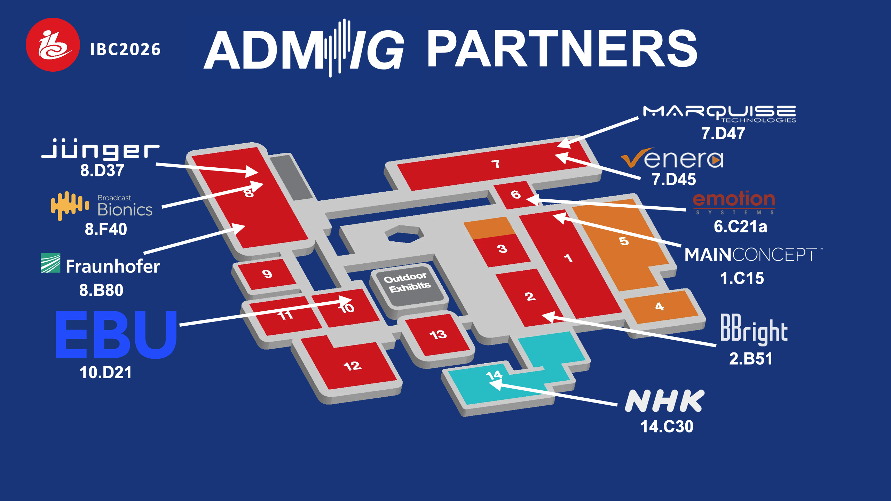
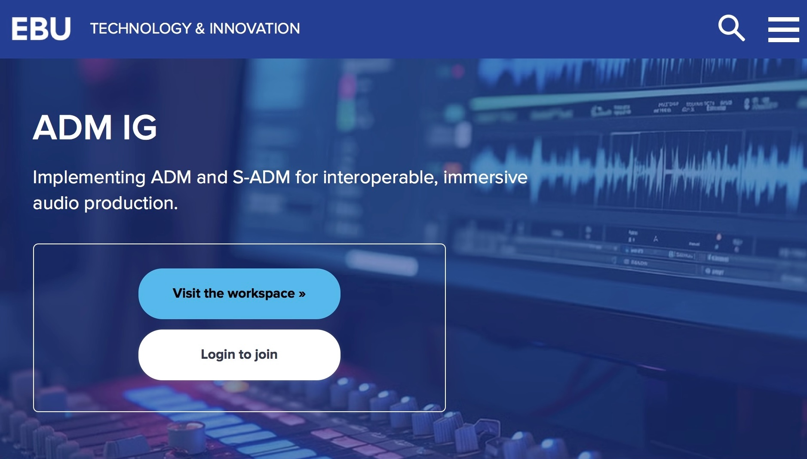

## ADM-IG@IBC2026

### ADM-IG PARTNER BOOTHS AT IBC
**Stop by our partners and get informed how ADM is implemented in pioneering products**

### DEMOS @ EBU 10.D21
Experts from ADM-IG partners will demo ADM applications and workflows at the ADM-IG hub.

#### SCHEDULE:

|DAY  \ SLOT | FRI SEP 11 | SAT SEP 12 | SUN SEP 13 | MON SEP 14 |
|-------|------------|------------|------------|------------|
forenoon (e.g. 11:00)| | | | |
afternoon (e.g. 15:00)| | ***EBU OpenSource Meet-up   feat. ADM pitch*** | | |

**Following the *Open Source Meet-up* at the EBU stand, ADM-IG will have an open meeting for all current and future partners and interested parties. Join us!**

### JOIN ADM-IG

Join-in - Stay informed - Get involved      
Hit the pic.

<!---->

By registerting you will be added to th ADM-IG mail-reflector and receive general information and invitations to join our regular workstreams calls.

You'll be in good company!

#[**Go here for the adm.ebu.io main page**](../index-reg.md)
