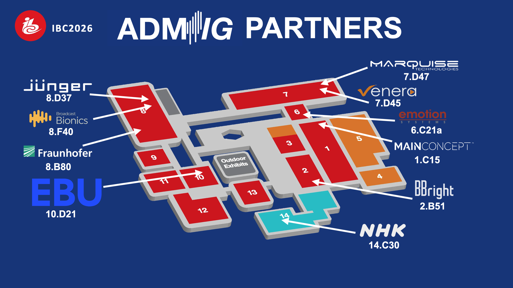
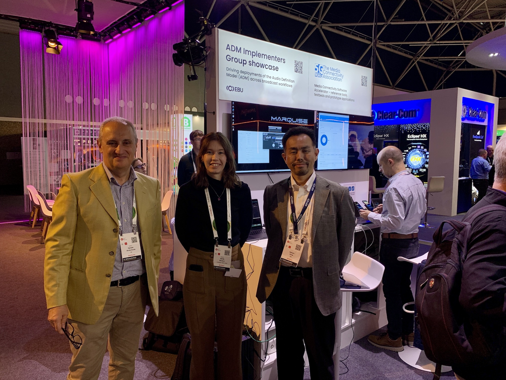
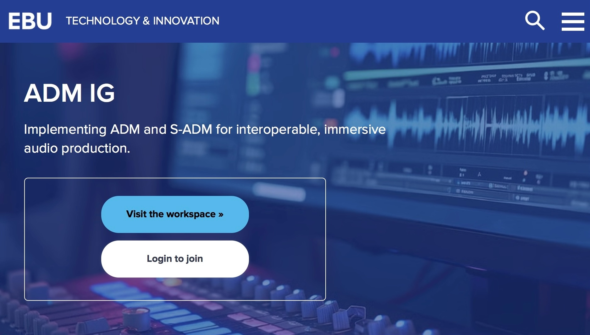
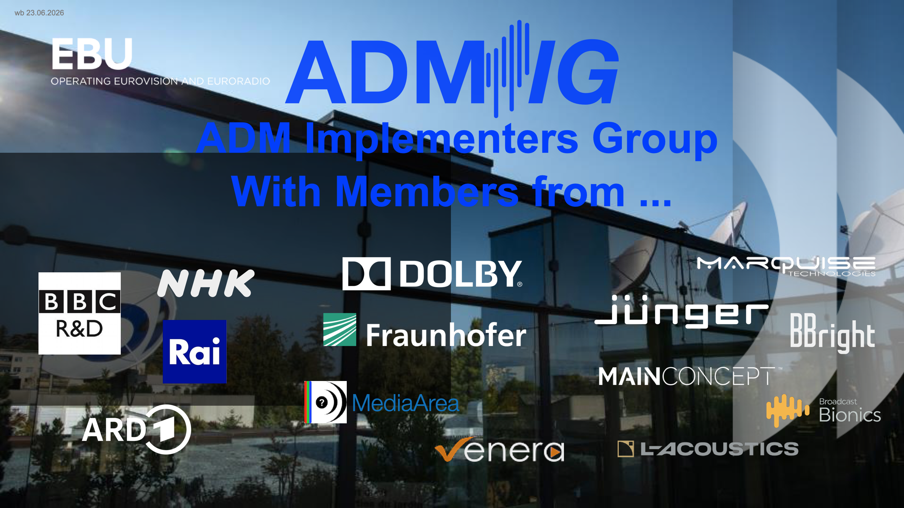

## ADM-IG@IBC2026

*ADM-IG* hit the floor at *IBC 2026*  with quite a number of members showing how ADM/S-ADM is alreday implemented in their pioneering products.

EBU generously hosted us during IBC 2026 at their booth and gave us opportunity to present ADM/S-ADM workflows and applications.

We were also invited to pitch ADM within 5 minutes at EBU's traditional *Open Source Meetup*.
You may catch-up on that at [EBU's web page](https://tech.ebu.ch/events/2026/open-source-meetup-ebu-ibc-2026)

### DEMOS @ EBU 10.D21
Experts from ADM-IG partners came-by to demo ADM applications and workflows at our stand, too. First on Friday morning was Aimee Moulson from Fraunhofer IIS.
ADM-IG Co-Chair Daniele Airola from RAI and Satoshi Oode from NHK welcomed her.

#### SCHEDULE:

|DAY  \ SLOT | FRI SEP 11 | SAT SEP 12 | SUN SEP 13 | MON SEP 14 |
|-------|------------|------------|------------|------------|
forenoon | 11:00 ADM with *MPEG-H*|11:00 EBU QC Meet-up   feat. ADM | 9:30 ADM-IG Meetup | 11:00 ADM with *MPEG-H*|
afternoon |13:00 ADM Tools from *NHK* | 13:00 ADM Tools from *NHK*    15:00 ADM in *Marquise MIST*   16:00 EBU OpenSource  Meet-up feat. ADM | | |

Finally, on Sunday 9:30 we've hosted an open meeting for all current and future partners and interested parties.

### JOIN ADM-IG

Join-in - Stay informed - Get involved      
Hit the pic.

<!---->

By registering you will be added to the ADM-IG mail-reflector and receive general information and invitations to join our regular workstreams calls.

You'll be in good company!

