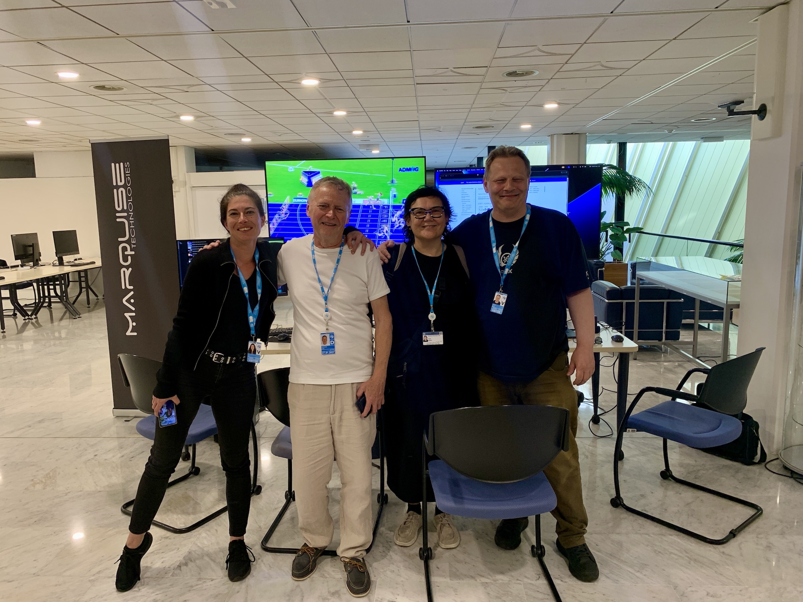

# PAST EVENTS

ADM-IG and its members have been participating and presenting ADM/S-ADM here:

* [**MXF INTEROP PLUGFEST 2025**](https://tech.ebu.ch/events/2025/mxf-interop-plugfest-2025) EBU Geneva 30/09/2025

* [**VDT TONMEISTERTAGUNG 2025**](https://tonmeistertagung.com/en/) 12/11/2025 Düsseldorf
   Presentations from Paola Sunna (EBU), Dave Marston (BBC R&D), Werner Bleisteiner (BR/EBU)

* [**EBU Production Technology Seminar 2026**](https://tech.ebu.ch/events/pts2026) 27-29/01/2026 Geneva
   First showcase of the [ADM Studio Set-up](../tech/ADM_studio.md) by BBC R&D, Jünger, BBright and Marquise Technologies

* [**NAB SHOW 2026**](https://www.nabshow.com) 18-22/04/2026 Las Vegas
   Jünger, BBright, Marquise Technologies

* [**MPTS 10**](https://www.mpts.london) 13-14/05/2026 London
    Broadcast Bionics

* **ADM-IG 1st ADM Plugfest** - virtual (file-exchange)
    See [this page here](plugfest1.md) for details

* [**IBC 2026**](https://show.ibc.org) 11-14/09/2026 Amsterdam
       Go to [our page here](ibc2026.md) for details

* [**ITU WP6B: Broadcast Service assembly and access**](https://www.itu.int/en/events/Pages/Calendar-Events.aspx) 21-25/09/2026 Geneva
       Demonstrations of ADM/S-ADM from EBU, NHK, BBC R&D and Marquise Technologies

To celebrate the 10th anniversary of the first standardisation of ADM, we've been invited to join the WP6B meetings in Geneva demonstrating what's become of ADM.
Chair Andy Quested is flanked by Virginie Allflatt (Marquise Technologies) and Paola Sunna (EBU), leaving Dan Tatut (Marquise Technologies) backs them up.

* [**Workshop Digital Broadcast 2026**](https://www.idmt.fraunhofer.de/de/events_and_exhibitions/wsdb.html) 22-23/09/2026 Erfurt
       Presentation on ADM/S-ADM Broadcast Implementation from BR
