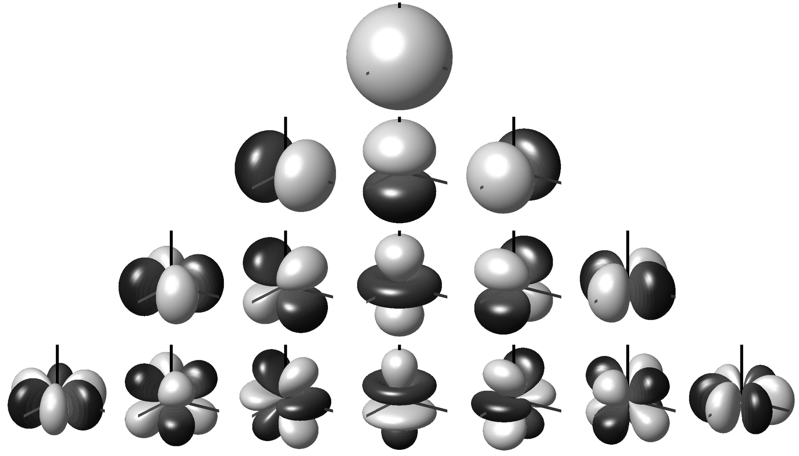

# Types of Audio

When we start to dive into the workings of the Audio Definition Model, we'll encounter five different [types](../reference/adm_elements/type_definitions.md) of audio. Here's an overview of these different types.

## Channel-based

This can almost be considered to be the default type of audio, the type we've been using ever since that first wax cylinder crackled into life. This is where an audio signal is expected to be delivered eventually to a loudspeaker without any need for modification. Mono, stereo, 5.1, 7.1 and 22.2 are all examples of channel-based formats, where each channel feeds a loudspeaker.

While channel-based audio had existed for many decades without the need for metadata, it is a useful addition to have to make things work easily. By labelling each channel with a suitable identifier we can ensure it ends up going to the correct speaker.

There are situations where channel-based audio channels can be processed and converted to other configurations. A common application is downmixing from 5.1 to stereo.

In ADM terminology channel-based audio is called 'DirectSpeakers', so not to get confused with the word 'channel' elsewhere.

## Scene-based

Scene-based audio is a more general term that includes [Ambisonics](https://en.wikipedia.org/wiki/Ambisonics) and Higher Order Ambisonics (HOA). Instead of each channel representing a single speaker, the channels represent a speaker-independent representation of the soundfield. The more channels used, the greater the spatial resolutions of the sound.

First order Ambisonics (strictly speaking referred to as the 0th-order channel) consists of 4 components channels. The first represents a onmi-directional signal, and the next 3 components represent the X, Y and Z dimensions of the sound.

As first order Ambisonics doesn't offer a very good spatial resolution (sounds are not localised very well), then higher orders (HOA) can be used to improve this. For 2nd order there are 5 additional components on top of the 1st order ones, and for 3rd order a further 7 components (so 16 component channels in total). The diagram below shows the polar patterns for each of the components for each order (0th at the top, 3rd at the bottom).

*by Dr Franz Zotter <zotter@iem.at> [CC BY-SA 3.0](https://creativecommons.org/licenses/by-sa/3.0) or [GFDL](http://www.gnu.org/copyleft/fdl.html), via Wikimedia Commons*

To convert HOA into speaker signals (i.e. convert to channel-based), a set decoding of equations are used. These can be suited to any chosen speaker layout, though the maths is easier and their performance tends to be better when the speaker layout is symmetrical in 3 dimensions.

## Object-based

Object-based audio, in this context (there's another definition of object-based, which is the more general audio+metadata one), is where each audio channel has positional (and maybe other spatial or signal-related properties) metadata attached to it. Each channel (or object) represents a single sound in a whole scene, so there may be many different objects that exist to build up with whole sound scene. Some of these objects may only exist for a finite time, and they may also move around and change their properties over time.

The actual audio signals in object-based audio can be played without metadata as simple mono signals, so can be processed in conventional ways (such as EQ); and objects can largely be treated as independent of each other. The metadata provides a [renderer](rendering.md) with enough information to attempt to spatially position the sound in the correct location alongside any other spatial characteristics it may have (such as diffuseness and size).

## Matrix-based

Matrix-based audio is when combinations of audio channels are combined via matrix equations to generate other channels. A simple example of this is Mid-Side audio, where the Mid channel is the sum of the Left and Right channels in a stereo pair, and the Side channel is the difference between Left and Right. Mid-Side is used in FM radio stereo encoding, so if the weaker Side channel can't be received then a mono signal (Mid) can still be recovered. Another example of Matrix audio is Lt/Rt encoding of 5.1 audio, which is a downmixing process.

## Binaural-based

Binaural audio is where spatial audio is intended to be played out over headphones (though loudspeaker-based solutions have been developed). Binaural audio makes use of the response of the human ear to give the impression of immersive sound over two channels (the left and right ears). Binaural audio can be generated using a binaural renderer than can interpret any of the other types of audio, or can be directly generated using a binaural microphone (either dummy head or in-ear microphones).

A downside with a binaural audio signal is that it is very difficult to convert it for an immersive multi-speaker playout.
