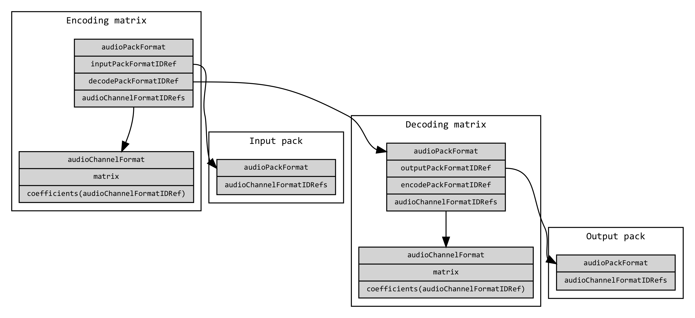
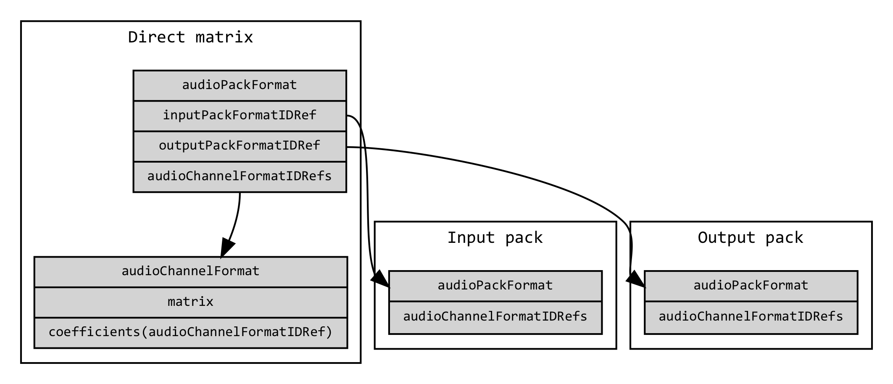

# audioPackFormat (Matrix)

The `audioPackFormat` with [`typeDefinition`](type_definitions.md) 'Matrix' needs extra sub-elements to allow the definition of encoding (e.g. Left/Right to Mid/Side), decoding (e.g. Mid/Side to Left/Right) and direct (e.g. Lo/Ro) matrices.

The matrix can either be an encoding, a decoding or a direct matrix. An encoding matrix converts an input pack of any type (though “DirectSpeakers” would be the most likely to be used) into a matrix-encoded pack. A decoding matrix takes matrix-encoded pack and converts into a channel-based output pack. Related encoding and decoding matrices can be cross-referenced.

For example, Stereo to Mid/Side would be an encoding matrix, and Mid/Side to Stereo would be a decoding matrix.

The diagram below how encoder and decoder matrix `audioPackFormat`s relate to each other, as well in the input and output `audioPackFormat`s and `audioChannelFormat`s.



The diagram below shows how a direct matrix `audioPackFormat` relates to input and output `audioPackFormat`s and `audioChannelFormat`s.



## Attributes

There are no additional attributes defined for the `audioPackFormat` with [`typeDefinition`](type_definitions.md) 'Matrix'. See [Common Attributes](audio_pack_format.md#common-attributes) for the list of common ones.

## Sub-elements

In addition to the [common sub-elements](audio_pack_format.md#common-sub-elements) the following sub-elements are defined for the `audioPackFormat` with [`typeDefinition`](type_definitions.md) 'Matrix'.

Even though it is defined as a common sub-element, the absoluteDistance sub-element is unlikely to be used in the 'Matrix' mode.

| Sub-element      | Description                                                       | Example | Quantity |
|------------------|-------------------------------------------------------------------|---------|----------|
| audioChannelFormatIDRef | Reference to an audioChannelFormat | AC_00021001 | 0...* |
| audioPackFormatIDRef | Reference to an audioPackFormat | AP_00021002 | 0...* |
| absoluteDistance | Absolute distance in metres | 4.5 | 0 or 1 |
| encodePackFormatIDRef | Reference to an encoding matrix audioPackFormat from a decoding matrix. | AP_00020001 | 0…* |
| decodePackFormatIDRef | Reference to a decoding matrix audioPackFormat from an encoding matrix. | AP_00020101 | 0 …* |
| inputPackFormatIDRef | Reference to a channel-based (DirectSpeakers) input audioPackFormat. | AP_00010002 | 0 or 1 |
| outputPackFormatIDRef | Reference to a channel-based (DirectSpeakers) matrix decoded audioPackFormat. | AP_00010002 | 0 or 1 |

The encoding matrix contains an inputPackFormatIDRef, which references a channel-based input pack. It can also contain a list of decodePackFormatIDRefs, which are references to corresponding decoding matrices.

The decoding matrix contains an outputPackFormatIDRef, which reference a channel-based output pack. It can also contain a list of encodePackFormatIDRefs, which are references to corresponding encoding matrices.

The direct matrix contains an inputPackFormatIDRef, which references a channel-based input pack and an outputPackFormatIDRef, which reference a channel-based output pack.


## Example

```xml
<audioPackFormat audioPackFormatID="AP_00021001"
                 audioPackFormatName="PackMat1_Encode"
                 typeLabel="0002" typeDefinition="Matrix">
  <audioChannelFormatIDRef>AC_00021001</audioChannelFormatIDRef>
  <audioChannelFormatIDRef>AC_00021002</audioChannelFormatIDRef>
  <decodePackFormatIDRef>AP_00021101</decodePackFormatIDRef>
  <inputPackFormatIDRef>AP_00010002</inputPackFormatIDRef>
</audioPackFormat>
```
