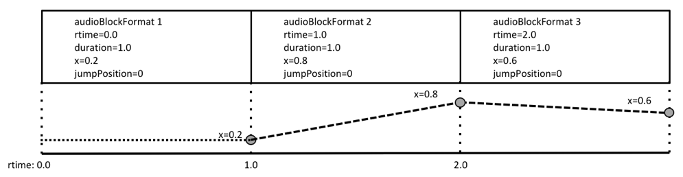
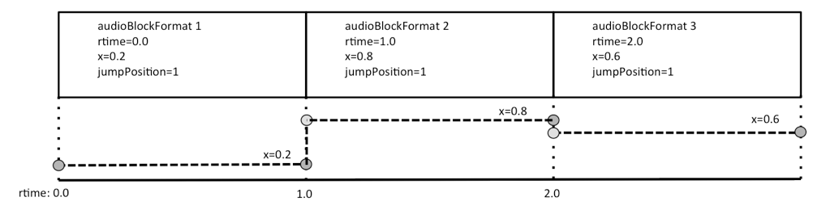
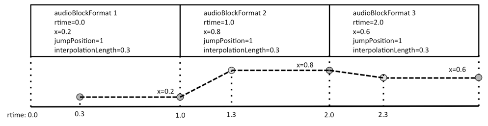
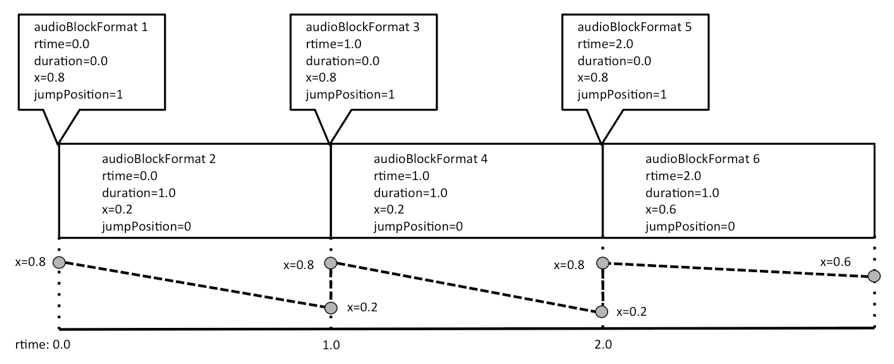

# jumpPosition and interpolationLength

The `jumpPosition` parameter appears in [`audioBlockFormat`](../audio_channel_format_objects.md#audioblockformat) only for the 'Objects' typeDefinition.

If the `jumpPosition` flag is set to 0 then the renderer will interpolate a moving object between positions over the full duration of the block. If it is set to 1 it will jump to the new position instantly. If the `interpolationLength` attribute is used when jumpPosition is 1, then the interpolation period is set to the `interpolationLength` value. The `interpolationLength` should be no longer than the block’s duration.

The `interpolationLength` parameter allows the interpolation of a moving object to be done over a shorter time period than the next update time. This allows the control of the crossfading of objects that may be desirable due to processing done to objects. If the value is set to zero then the object will jump position without interpolation. If this attribute is not included when `jumpPosition` is set to 1, then the interpolation length will be set to 0.

It is recommended that `audioBlockFormat` sizes are chosen to be small enough to avoid the use of the `interpolationLength` parameter for smoothly moving objects.

To help illustrate how `jumpPosition` and `interpolationLength` are interpreted, the following diagrams show a sequence of `audioBlockFormat`s and how a dymanic parameter’s value varies over time. The first example in the figure shows when `jumpPosition` is set to zero (or not used), so the parameter (x in this case) is interpolated over the duration of the entire `audioBlockFormat`s. As the first block has a `jumpPosition` of zero and is not proceeded by another block the x value is only known at the end of the block, therefore the position at the start of the first block is effectively undefined. If this situation occurs, then the position at the start of the first block is made the same as the end of the block.

The second example in the figure below shows how the value of x varies when `jumpPosition` is set to 1 and no `interpolationLength` is set. The value of x is set at the beginning of the block and maintains that value throughout its duration. This also shows that the first block has a defined position from the beginning, and thus illustrates that it is recommended to set `jumpPosition` to 1 for the first block in a sequence.

The third example in the figure below shows how the use of the `interpolationLength` attribute varies the value of x over the sequence of blocks. In this example, each `interpolationLength` is set to 0.3, so the value of x is interpolated over the first 0.3 seconds of the block, and then is locked to the defined value for the remainder of the block. The first block has an undefined value of x for the first 0.3 seconds.

The fourth example in the figure below shows how zero length blocks can be used to make a position jump, but also allow for interpolation to follow immediately. By having a first block of zero length it can ensure an initial position is always present. 

To ensure undefined behaviour of the first block is avoided, then the position specified in the first block covers the entire length of the block (regardless of the `jumpPosition` and `interpolationLength` properties).

The following parameters can be interpolated: `position`, `width`, `height`, `depth`, `diffuse`, `gain`, and `objectDivergence`.

The other parameters in `audioBlockFormat` should not be interpolated and should remain constant for the duration of the block.

