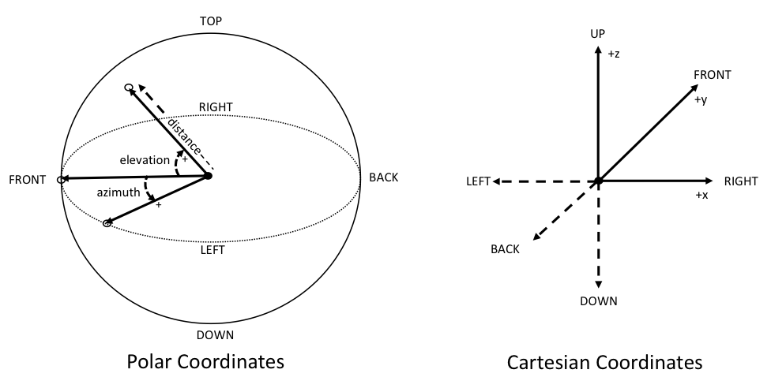
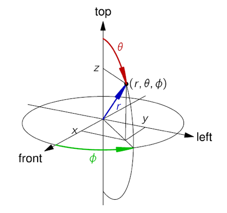

# Coordinate System

The position elements in [`audioBlockFormat`](../adm_elements/audio_channel_format_objects.md#audioblockformat), for both the ‘DirectSpeakers’ and ‘Objects’ typeDefinitions, allow different axes to be specified in the coordinate attribute. A polar coordinate system, which uses azimuth, elevation and distance, and the Cartesian coordinate system, which uses X, Y, and Z. The azimuth and elevation angle may also be used for the equation sub-element for scene-based audio. To ensure consistency when specifying positions each of the polar axes should be based on these guidelines:

 * **The origin is in the centre**, where the sweet-spot would be (although some systems do not have a sweet-spot, so the centre of the space should be assumed).
 * **Azimuth** – angle in the horizontal plane with 0 degrees as straight ahead, and positive angles to the left (or anti-clockwise) when viewed from above.
 * **Elevation** – angle in the vertical plane with 0 degrees horizontally ahead, and positive angles going up.
 * **Distance** – a normalised distance, where 1.0 is assumed to be the default radius of the sphere.

Cartesian coordinates, which is also used for object-based audio, and is supported by using X, Y and Z as the coordinate attributes. It is recommended that normalised values be used here, where the values 1.0 and −1.0 are on the surface of the cube, with the origin being the centre of the cube.

The direction of each axis should be:
 * **X** – left to right, with positive values to the right.
 * **Y** – front to back, with positive values to the front.
 * **Z** – top to bottom, with positive values to the top.

If normalised distances are used in the coordinate system they can be scaled to an absolute distance by multiplying by the `absoluteDistance` parameter in the `audioPackFormat`.

For scene-based audio, the coordinate system is also Cartesian based, but the axes are different. The reason for the different axes for scene-based audio is a legacy of the development of Ambisonics, which has always used these axes. In this case the direction of each axis is:

 * **X** – front to back, with positive values to the front.
 * **Y** – left to right, with positive values to the left.
 * **Z** – top to bottom, with positive values to the top.

To avoid confusion with the other Cartesian system, it is recommended the axes be labelled ‘X_HOA’, ‘Y_HOA’ & ‘Z_HOA’. However, the HOA component definitions are unlikely to include coordinate information and so this information is primarily to ensure the rendering is correctly done.

The spherical coordinate system for scene-based audio is used according to the following figure:

