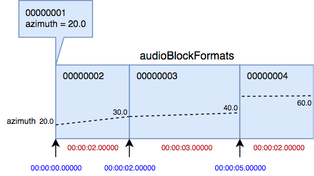
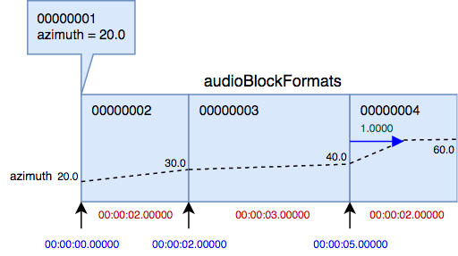

# Dynamic and Static Metadata

## Using audioBlockFormats

Now that the basics of [timing](timing.md) have been covered, we can now go into more detail about dynamic metadata. The [`audioChannelFormat`](../reference/adm_elements/audio_channel_format.md) element can contain one or more `audioBlockFormat` children elements. These `audioBlockFormat`s (we'll call them blocks) can have time limits which are defined by the **rtime** and **duration** attributes. The **rtime** attribute specifies the start time of the blocks, and the **duration** attribute is the block's duration.

Let's introduce a couple of rules that exist for blocks:
  * Successive `audioBlockFormat`s should be contiguous. Therefore, the **rtime** of a block should equal the **rtime** + **duration** of the previous block.
  * It is recommended to have the first `audioBlockFormat` in an `audioChannelFormat` starting at `00:00:00.00000`.

Taking the example code from the [timing page](timing.md), here are three blocks of 2, 3 and 2 seconds duration:

```xml
<audioChannelFormat audioChannelFormatID="AC_00031001"
                audioChannelFormatName="Channel1">
  <audioBlockFormat audioBlockFormatID="AB_00031001_00000001"
                    rtime="00:00:00.00000" duration="00:02.00000">
    ...
  </audioBlockFormat>
  <audioBlockFormat audioBlockFormatID="AB_00031001_00000002"
                    rtime="00:02:00.00000" duration="00:03.00000">
    ...
  </audioBlockFormat>
  <audioBlockFormat audioBlockFormatID="AB_00031001_00000003"
                    rtime="00:05:00.00000" duration="00:02.00000">
    ...
  </audioBlockFormat>
</audioChannelFormat>
```

Within each of these blocks we can put some more parameters whose values can vary between blocks to provide dynamic behaviour for the channel, such as an audio object with a position that moves. Let's expand our example to make an audio object move in space over the three blocks:

```xml
<audioChannelFormat audioChannelFormatID="AC_00031001"
                audioChannelFormatName="Channel1"
                typeDefinition="Objects">
  <audioBlockFormat audioBlockFormatID="AB_00031001_00000001"
                    rtime="00:00:00.00000" duration="00:00.00000">
    <position coordinate="azimuth">20.0</position>
    <position coordinate="elevation">-10.0</position>
  </audioBlockFormat>
  <audioBlockFormat audioBlockFormatID="AB_00031001_00000002"
                    rtime="00:00:00.00000" duration="00:02.00000">
    <position coordinate="azimuth">30.0</position>
    <position coordinate="elevation">0.0</position>
  </audioBlockFormat>
  <audioBlockFormat audioBlockFormatID="AB_00031001_00000003"
                    rtime="00:02:00.00000" duration="00:03.00000">
    <position coordinate="azimuth">40.0</position>
    <position coordinate="elevation">15.0</position>
  </audioBlockFormat>
  <audioBlockFormat audioBlockFormatID="AB_00031001_00000004"
                    rtime="00:05:00.00000" duration="00:02.00000">
    <position coordinate="azimuth">60.0</position>
    <position coordinate="elevation">20.0</position>
  </audioBlockFormat>
</audioChannelFormat>
```

Here we've added some position sub-elements to the blocks to give them some polar coordinate locations. You'll also notice the **typeDefinition** attribute has been added to the `audioChannelFormat` to indicate we're using the 'Objects' type of audio. The other thing you should have noticed, is that there are now four blocks instead of three, with a zero duration block introduced at the beginning. The reason for this is that the position parameter defines the position at the end of the block, so without this zero duration initial block we don't have a reliable way of defining the initial position.

## Interpolation

The diagram below illustrates how the azimuth value changes over the series of blocks, starting at 20.0, and ending at 60.0 after 7 seconds. The first block, which initialises the position, has a zero duration.


The path between the azimuth values on the block boundaries are illustrated as straight lines in this diagram. This is to show that the value is interpolated over the duration of the block. The ADM specification does not define a method of interpolation, and this is left to the renderer or other ADM processor to decide the method of doing so. However, the expectation is that the sound should move smoothly between the start and end of a block.  

If interpolation is not desired, then there is a parameter called `jumpPosition` that can be used, and this makes the position jump immediately to the block's position values rather than interpolating from the previous one. Let's add this parameter to the last block:

```xml
  <audioBlockFormat audioBlockFormatID="AB_00031001_00000004"
                    rtime="00:05:00.00000" duration="00:02.00000">
    <position coordinate="azimuth">60.0</position>
    <position coordinate="elevation">20.0</position>
    <jumpPosition>1</jumpPosition>
  </audioBlockFormat>
```

This results in the position being jumped to at the beginning of the frame and staying at those values until the end, as shown for azimuth in the diagram below:



The `jumpPosition` also contains an optional attribute called **interpolationLength** that allows you to change the jump from an instant to an interpolated one over the time period you specify. Let's update the code with an **interpolationLength** of 1 second:

```xml
  <audioBlockFormat audioBlockFormatID="AB_00031001_00000004"
                    rtime="00:05:00.00000" duration="00:02.00000">
    <position coordinate="azimuth">60.0</position>
    <position coordinate="elevation">20.0</position>
    <jumpPosition interpolationLength="1.00000">1</jumpPosition>
  </audioBlockFormat>
```

This results in the azimuth in this block starting at 40 (from the previous block) and changing to 60 over a period of 1 second, and then staying at 60 until the end of the block. The following diagram show this:



When it comes to choosing the duration of block sizes for dynamic objects, it is a balance between the quantity of blocks and accuracy of the movement. If the blocks are too large, then you become reliant on an interpolator doing a good job, and some trajectories can cause renderers difficulties. If the blocks are too small, then you can end up with extremely large files. Block sizes do not have to be all the same duration within a channel, so it is often worth adapting their size to suit the behaviour of the movement.

## Static metadata

There are many situations, where dynamic metadata is not required. If your audio objects aren't moving, or you're using one of the other **typeDefinitions**, then the metadata within an `audioChannelFormat` is likely to be static. With static metadata only one `audioBlockFormat` is required, and we don't need to include **rtime** and **duration** attributes, as the block is considered to be unbounded. Here's an example of a static `audioChannelFormat`:

```xml
<audioChannelFormat audioChannelFormatID="AC_00031002"
                audioChannelFormatName="Channel2"
                typeDefinition="Objects">
  <audioBlockFormat audioBlockFormatID="AB_00031002_00000001">
    <position coordinate="azimuth">30.0</position>
    <position coordinate="elevation">0.0</position>
  </audioBlockFormat>
</audioChannelFormat>
```

In this example the azimuth of 30 and elevation of 0 lasts for the duration of the channel.

## Further reading

An example of dynamic metadata can be found in the use cases on the [Dynamic Mixed](../use_cases/dynamic_mixed.md) page.
