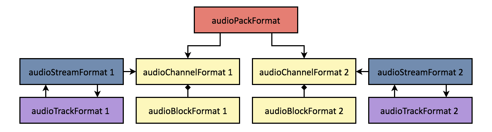
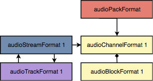

# Format part

The ADM is divided into the content part and the format part. The format part can
exist without the content part, but not the other way around. So let us start
with some examples which only use the ADM elements of the format part.

## Channel-based

As a first example let's describe a standard stereo signal using the ADM. We
start with two `audioChannelFormat`s and an `audioPackFormat` to group our two
channels. All three ADM elements must have the 'DirectSpeakers' `typeDefinition`
and the `audioPackFormat` references the two `audioChannelFormat`s.


The two `audioChannelFormat`s each contain one `audioBlockFormat` with the
position of the loudspeaker.


Next we have to link the `audioChannelFormat`s with an audio track. So we are
adding two `audioTrackFormat`s. We also need two `audioStreamFormat`s. An
`audioStreamFormat` combines multiple tracks, this becomes useful when multiple
tracks are encoded into a single stream (for example with coded audio such as Dolby-E). For PCM encoded audio it does not add
any additional information and just links the track with the
`audioChannelFormat`. `audioTrackFormat` and `audioStreamFormat` reference each
other, that a software which parses the model can start from either of the two.

For the loudspeaker setups described in [Recommendation ITU-R
BS.2051](https://www.itu.int/rec/R-REC-BS.2051/en) the required ADM elements are
already described in the [common definitions](https://www.itu.int/rec/R-REC-BS.2094/en). So it is not necessary
to manually add those, but one should just reference the ADM elements in the
common definitions.



So, let us have a look at the definition of the ADM elements we need as they are
described in the common definitions.

``` xml
<audioPackFormat audioPackFormatID="AP_00010002"
                 audioPackFormatName="urn:itu:bs:2051:0:pack:stereo_(0+2+0)"
                 typeLabel="0001" typeDefinition="DirectSpeakers">
  <audioChannelFormatIDRef>AC_00010001</audioChannelFormatIDRef>
  <audioChannelFormatIDRef>AC_00010002</audioChannelFormatIDRef>
</audioPackFormat>
<audioChannelFormat audioChannelFormatID="AC_00010001"
                    audioChannelFormatName="FrontLeft"
                    typeLabel="0001" typeDefinition="DirectSpeakers">
  <audioBlockFormat audioBlockFormatID="AB_00010001_00000001">
    <speakerLabel>urn:itu:bs:2051:0:speaker:M+030</speakerLabel>
    <position coordinate="azimuth">30.0</position>
    <position coordinate="elevation">0.0</position>
    <position coordinate="distance">1.0</position>
  </audioBlockFormat>
</audioChannelFormat>
<audioChannelFormat audioChannelFormatID="AC_00010002"
                    audioChannelFormatName="FrontRight"
                    typeLabel="0001" typeDefinition="DirectSpeakers">
  <audioBlockFormat audioBlockFormatID="AB_00010002_00000001">
    <speakerLabel>urn:itu:bs:2051:0:speaker:M-030</speakerLabel>
    <position coordinate="azimuth">-30.0</position>
    <position coordinate="elevation">0.0</position>
    <position coordinate="distance">1.0</position>
  </audioBlockFormat>
</audioChannelFormat>
<audioStreamFormat audioStreamFormatID="AS_00010001"
                   audioStreamFormatName="PCM_FrontLeft"
                   formatLabel="0001" formatDefinition="PCM">
  <audioChannelFormatIDRef>AC_00010001</audioChannelFormatIDRef>
  <audioTrackFormatIDRef>AT_00010001_01</audioTrackFormatIDRef>
</audioStreamFormat>
<audioStreamFormat audioStreamFormatID="AS_00010002"
                   audioStreamFormatName="PCM_FrontRight"
                   formatLabel="0001" formatDefinition="PCM">
  <audioChannelFormatIDRef>AC_00010002</audioChannelFormatIDRef>
  <audioTrackFormatIDRef>AT_00010002_01</audioTrackFormatIDRef>
</audioStreamFormat>
<audioTrackFormat audioTrackFormatID="AT_00010001_01"
                  audioTrackFormatName="PCM_FrontLeft"
                  formatLabel="0001" formatDefinition="PCM">
  <audioStreamFormatIDRef>AS_00010001</audioStreamFormatIDRef>
</audioTrackFormat>
<audioTrackFormat audioTrackFormatID="AT_00010002_01"
                  audioTrackFormatName="PCM_FrontRight"
                  formatLabel="0001" formatDefinition="PCM">
  <audioStreamFormatIDRef>AS_00010002</audioStreamFormatIDRef>
</audioTrackFormat>
```

Assuming we are using our ADM in a BW64 file we are left with linking the actual
tracks in the file with our ADM audio tracks.


As we are using the common definitions we actually don't need any manually
specified ADM elements at all and can use the common definitions. The entries in
the 'chna' chunk table then have to be like this (assuming the left channel is on
track&nbsp;1 and the right channel on track&nbsp;2):

| TrackNum | audioTrackUID | audioTrackFormatID | audioPackFormatID |
|----------|---------------|--------------------|-------------------|
| 1        | ATU_00000001  | AT_00010001_01     | AP_00010002       |
| 2        | ATU_00000002  | AT_00010002_01     | AP_00010002       |

## Object-based

For object-based the structure is very similar, so for one object we have
essentially the same structure as before ('chna' chunk omitted).



Let us have a look at the XML document corresponding to this structure.

```xml
<audioFormatExtended>
  <audioPackFormat audioPackFormatID="AP_00031001" audioPackFormatName="Narrator" typeDefinition="Objects">
    <audioChannelFormatIDRef>AC_00031001</audioChannelFormatIDRef>
  </audioPackFormat>
  <audioChannelFormat audioChannelFormatID="AC_00031001" audioChannelFormatName="Narrator" typeDefinition="Objects">
    <audioBlockFormat audioBlockFormatID="AB_00031001_00000001">
      <position coordinate="azimuth">0.000000</position>
      <position coordinate="elevation">0.000000</position>
    </audioBlockFormat>
  </audioChannelFormat>
  <audioStreamFormat audioStreamFormatID="AS_00031001" audioStreamFormatName="Narrator" formatDefinition="PCM">
    <audioChannelFormatIDRef>AC_00031001</audioChannelFormatIDRef>
    <audioTrackFormatIDRef>AT_00031001_01</audioTrackFormatIDRef>
  </audioStreamFormat>
  <audioTrackFormat audioTrackFormatID="AT_00031001_01" audioTrackFormatName="Narrator" formatDefinition="PCM">
    <audioStreamFormatIDRef>AS_00031001</audioStreamFormatIDRef>
  </audioTrackFormat>
</audioFormatExtended>
```

There are two main differences. First, there are no common definitions for
`Objects` and second, we need to use the Objects [`typeDefinition`](../reference/adm_elements/type_definitions.md). Both differences are manifesting themselves in the ADM element IDs. The
first four-digit hexadecimal part is now `0003` (for Objects `typeDefinition`)
and the second four-digit hexadecimal part starts with `1001`, as the range
`0000`–`0FFF` is reserved for common definitions.

An object-based ADM document doesn't make much sense without the content part.
Now let's build upon this example and add some content part ADM elements, which you can read about in the [next step](content_part.md).
