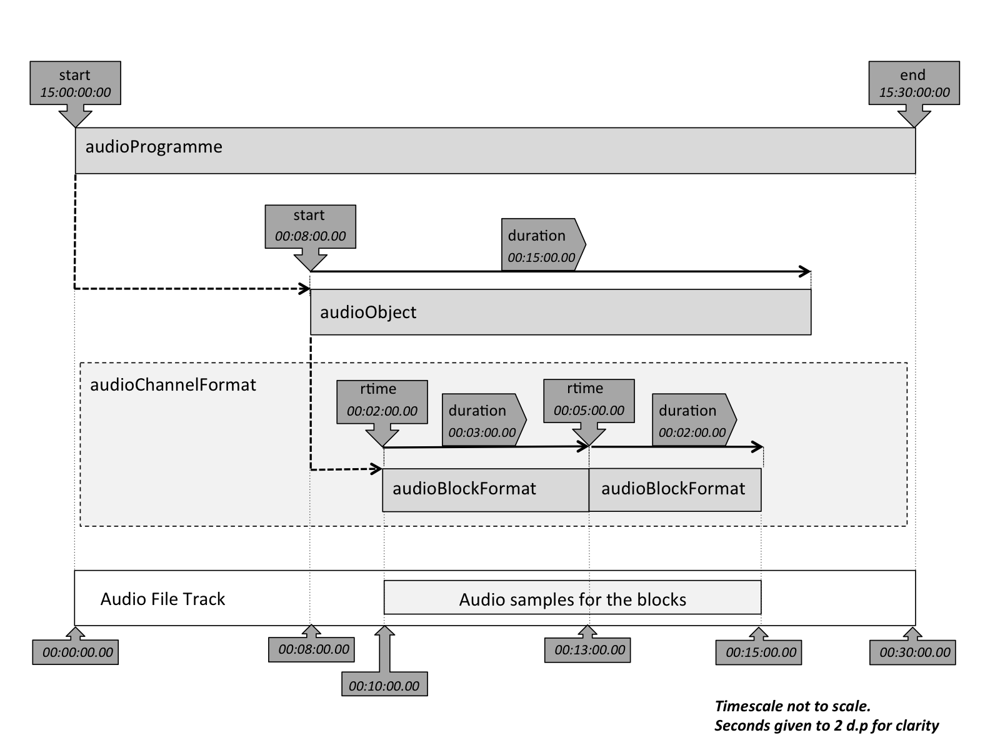

# Timing

## The Basics

One of the key features of object-based audio is that audio objects can last for finite period of time (instead of the whole duration of the programme), and that some of their properties can vary over time. Therefore, the audio metadata needs some time-related parameters to describes these properties. The ADM has time and duration attributes in various elements, and their correct use is important to ensure things work correctly.

The elements that contain time related parameters are:

| Element | Attribute | Meaning |
|---------|-----------|---------|
| audioProgramme | start | Time for the start of the programme |
| | end | Time for the end of the programme |
| audioObject | start | Start time of an object in seconds relative to the start of the programme. |
| | duration | Duration in seconds of an object. |
| audioBlockFormat | rtime | Start time in seconds of a block relative to the start of the object. |
| | duration | Duration in seconds of a block. |

To help explain how these elements relate to each the other, the diagram below shows the relationships.



The **start** of `audioProgramme` can be given a time (this is not essential, but recommended if it known), but this has no influence on the audio contents of the file; the `audioProgramme` is describing the whole file, so it starts at the first sample and ends at the last.  In the example in the diagram, the time starts at `15:00:00:00` and ends at `15:30:00:00`. It is important to ensure that **end** – **start** = the actual duration of the file. All the other timing takes the start of the audio file as time zero. The XML below shows how this is represented (an `audioContent` element has been added to provide the reference to an `audioObject` element):

```xml
<audioProgramme audioProgrammeID="APR_1001"
                audioProgrammeName="Prog"
                start="15:00:00.00000" end="15:30:00.00000">
  <audioContent audioContentName="Cont1"
                audioContentID="ACO_1001">
    <audioObjectIDRef>AO_1001</audioObjectIDRef>
  </audioContent>
  ...
</audioProgramme>
```

The `audioObject` **start** attribute corresponds to the start time of the object relative to the start of the file. The **duration** attribute corresponds to how long this object lasts. If this parameter is omitted the object lasts for the whole duration of the file. The audio samples in the file will correspond to the **start** and **duration** of the object as shown in the diagram (in the example this will be from `00:08:00.00` to `00:23:00.00`). The XML below shows how this is represented (an `audioPackFormat` element has been added to provide a reference to an `audioChannelFormat` element):

```xml
<audioObject audioObjectID="AO_1001"
                audioObjectName="Object1"
                start="00:08:00.00000" duration="00:15:00.00000">
  <audioPackFormat audioPackFormatID="AP_00031001"
                   audioPackFormatName="Pack1">
    <audioChannelFormatIDRef>AC_000310001</audioChannelFormatIDRef>
  </audioPackFormat>
  ...
</audioObject>
```

The `audioObject` refers to an `audioPackFormat` (not shown for clarity) and an `audioChannelFormat`, which do not possess timing properties.  The `audioChannelFormat` contains one or more `audioBlockFormat`s that contain the finest level of timing information. By using multiple `audioBlockFormat`s, where their parameters vary over sucessive blocks, dynamic behaviour for that channel can be achieved.

The start (**rtime**) of the `audioBlockFormat` is relative to the start of the `audioObject`. So the positions of the audio samples in the file corresponding to a particular `audioBlockFormat` is found by adding its **rtime** to the **start** of the `audioObject` to get the first sample, and adding its **duration** to find the last sample. The XML below shows how this represented. Note that the first `audioBlockFormat` in the code isn't shown in the diagram, as the first block ought to start at a **rtime** of zero, but the diagram wouldn't illustrate the relationship between `audioBlockFormat` and `audioObject` so clearly if it was shown.

```xml
<audioChannelFormat audioChannelFormatID="AC_00031001"
                audioChannelFormatName="Channel1">
  <audioBlockFormat audioBlockFormatID="AB_00031001_00000001"
                    rtime="00:00:00.00000" duration="00:02.00000">
    ...
  </audioBlockFormat>
  <audioBlockFormat audioBlockFormatID="AB_00031001_00000002"
                    rtime="00:02:00.00000" duration="00:03.00000">
    ...
  </audioBlockFormat>
  <audioBlockFormat audioBlockFormatID="AB_00031001_00000003"
                    rtime="00:05:00.00000" duration="00:02.00000">
    ...
  </audioBlockFormat>
</audioChannelFormat>
```

## Rules to Follow

Is it possible to give timing values that are invalid or problematic, such as values that run off the end of the audio file or cause overlapping blocks. There are some rules that should be followed to ensure a correctly functioning file:

1. All the time and duration values must be non-negative.
2. The time attributes should be in the correct format: `HH:MM:SS.sssss` (where `sssss` is at least 5 d.p. of the seconds) for the attributes in all elements. More than 5 d.p. can be used, and is recommended for sampling rates greater than 48 kHz. For nanosecond precision 9 d.p. should be used.
3. The difference between the `audioProgramme` **start** and **end** time should match the duration of the audio file – within the precision of the timecode representation. Omit the end attribute if it is uncertain what the length is.
4. The **start** + **duration** time of `audioObject`s should not be more than the duration of the file.
5. The **rtime** + **duration** time of `audioBlockFormat`s should not be more than the **start** + **duration** of the referring `audioObject` if possible.
6. If the `audioBlockFormat`s overrun the end of an `audioObject`, then it will be assumed the audio samples will only be read for the **duration** of the `audioObject`.
7. The order of `audioBlockFormat`s within an `audioChannelFormat` should be chronological in the XML code.
8. Successive `audioBlockFormat`s should be contiguous. Therefore, the **rtime** of a block should equal the **rtime** + **duration** of the previous block.
9. It is recommended to have the first `audioBlockFormat` in an `audioChannelFormat` starting at `00:00:00.00000`. Use the **start** time of the `audioObject` to set the starting time of a sequence of blocks.

To finish this tutorial, we explore how static and dynamic metadata can be used in conjunction with timing in the [final step](dynamic.md).
