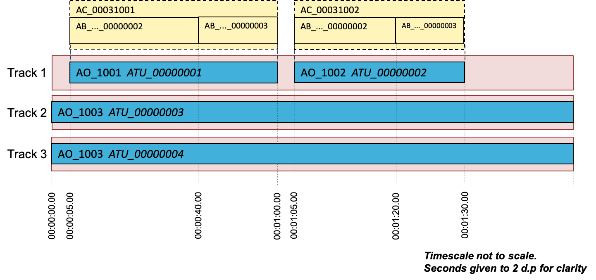
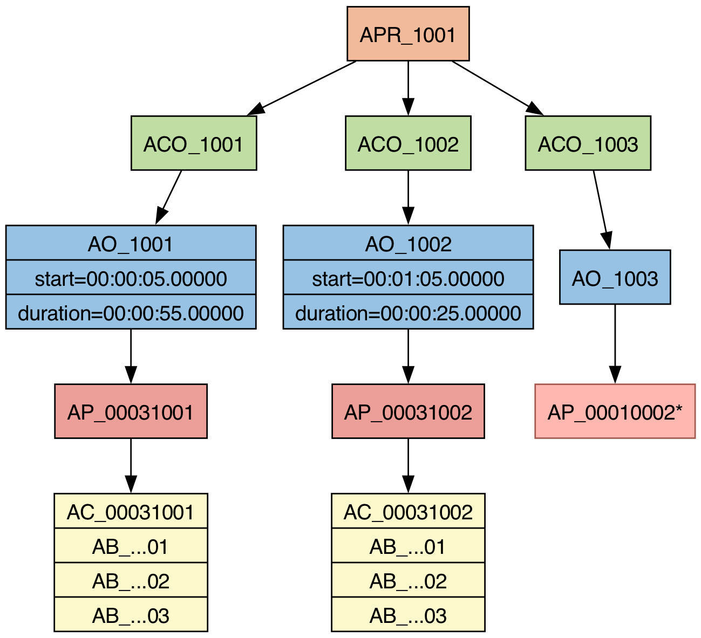

# Description
This use case demonstrates the use of dynamic objects. It contains two moving objects that appear at different times, and share the same track. It also contains a channel-based stereo bed.

# Approach
The two dynamic objects are both of the `Objects` typeDefinition. Each object contains three `audioBlockFormats`, with the first one of zero duration to initialise the position at the start of the channel. The `audioObjects` that reference each of these two objects have different start times, and do not overlap in time. Therefore the two `audioTrackUIDs` (`ATU_00000001` and `ATU_00000002`) can share the same track in the BW64 file, as shown in the diagram: 



This can be defined in the 'chna' chunk as shown:

| TrackNum | audioTrackUID | audioTrackFormatID | audioPackFormatID |
|----------|---------------|--------------------|-------------------|
| 1        | ATU_00000001  | AT_00031001_01     | AP_00031001       |
| 1        | ATU_00000002  | AT_00031002_01     | AP_00031002       |
| 2        | ATU_00000003  | AT_00010001_01     | AP_00010002       |
| 3        | ATU_00000004  | AT_00010002_01     | AP_00010002       |

As well as the two dynamic objects, there is a stereo channel-based `audioObject`, which uses `audioTrackUIDs` `ATU_00000003` and `ATU_00000004`. As this object uses a common definition format (`AP_00010002`), then the metadata for those elements do not have to be included in this file. Unlike the two dynamic objects, the channel-based object is not time restricted, so lasts the duration of the programme.



# Example XML

```xml
<?xml version="1.0" encoding="utf-8"?>
<ebuCoreMain xmlns:dc="http://purl.org/dc/elements/1.1/" xmlns="urn:ebu:metadata-schema:ebuCore_2014" xmlns:xsi="http://www.w3.org/2001/XMLSchema-instance" schema="EBU_CORE_20140201.xsd" xml:lang="en">
  <coreMetadata>
    <format>
      <audioFormatExtended version="ITU-R_BS.2076-1">
        <audioProgramme audioProgrammeID="APR_1001" audioProgrammeName="Dynamic Mixed">
          <audioContentIDRef>ACO_1001</audioContentIDRef>
          <audioContentIDRef>ACO_1002</audioContentIDRef>
          <audioContentIDRef>ACO_1003</audioContentIDRef>
        </audioProgramme>
    
        <audioContent audioContentID="ACO_1001" audioContentName="Object 1">
          <audioObjectIDRef>AO_1001</audioObjectIDRef>
        </audioContent>
        <audioContent audioContentID="ACO_1002" audioContentName="Object 2">
          <audioObjectIDRef>AO_1002</audioObjectIDRef>
        </audioContent>
        <audioContent audioContentID="ACO_1003" audioContentName="Background">
          <audioObjectIDRef>AO_1003</audioObjectIDRef>
        </audioContent>
    
        <audioObject audioObjectID="AO_1001" audioObjectName="Object 1" start="00:00:05.00000" duration="00:00:55.00000">
          <audioPackFormatIDRef>AP_00031001</audioPackFormatIDRef>
          <audioTrackUIDRef>ATU_00000001</audioTrackUIDRef>
        </audioObject>
        <audioObject audioObjectID="AO_1002" audioObjectName="Object 2" start="00:01:05.00000" duration="00:00:25.00000">
          <audioPackFormatIDRef>AP_00031002</audioPackFormatIDRef>
          <audioTrackUIDRef>ATU_00000002</audioTrackUIDRef>
        </audioObject>
        <audioObject audioObjectID="AO_1003" audioObjectName="Background">
          <audioPackFormatIDRef>AP_00010002</audioPackFormatIDRef>
          <audioTrackUIDRef>ATU_00000003</audioTrackUIDRef>
          <audioTrackUIDRef>ATU_00000004</audioTrackUIDRef>
        </audioObject>
    
        <audioPackFormat audioPackFormatID="AP_00031001" audioPackFormatName="Object 1" typeLabel="0003" typeDefinition="Objects">
          <audioChannelFormatIDRef>AC_00031001</audioChannelFormatIDRef>
        </audioPackFormat>
        <audioPackFormat audioPackFormatID="AP_00031002" audioPackFormatName="Object 2" typeLabel="0003" typeDefinition="Objects">
          <audioChannelFormatIDRef>AC_00031002</audioChannelFormatIDRef>
        </audioPackFormat>
    
        <audioChannelFormat audioChannelFormatID="AC_00031001" audioChannelFormatName="Object 1" typeLabel="0003" typeDefinition="Objects">
          <audioBlockFormat audioBlockFormatID="AB_00031001_00000001" rtime="00:00:00.00000" duration="00:00:00.00000">
            <position coordinate="azimuth">80.000000</position>
            <position coordinate="elevation">10.000000</position>
          </audioBlockFormat>
          <audioBlockFormat audioBlockFormatID="AB_00031001_00000002" rtime="00:00:00.00000" duration="00:00:35.00000">
            <position coordinate="azimuth">60.000000</position>
            <position coordinate="elevation">15.000000</position>
          </audioBlockFormat>
          <audioBlockFormat audioBlockFormatID="AB_00031001_00000003" rtime="00:00:35.00000" duration="00:00:20.00000">
            <position coordinate="azimuth">50.000000</position>
            <position coordinate="elevation">30.000000</position>
          </audioBlockFormat>
        </audioChannelFormat>
        <audioChannelFormat audioChannelFormatID="AC_00031002" audioChannelFormatName="Object 2" typeLabel="0003" typeDefinition="Objects">
          <audioBlockFormat audioBlockFormatID="AB_00031002_00000001" rtime="00:00:00.00000" duration="00:00:00.00000">
            <position coordinate="azimuth">-110.000000</position>
            <position coordinate="elevation">-20.000000</position>
          </audioBlockFormat>
          <audioBlockFormat audioBlockFormatID="AB_00031002_00000002" rtime="00:00:00.00000" duration="00:00:15.00000">
            <position coordinate="azimuth">-80.000000</position>
            <position coordinate="elevation">0.000000</position>
          </audioBlockFormat>
          <audioBlockFormat audioBlockFormatID="AB_00031002_00000003" rtime="00:00:15.00000" duration="00:00:10.00000">
            <position coordinate="azimuth">-20.000000</position>
            <position coordinate="elevation">10.000000</position>
          </audioBlockFormat>
        </audioChannelFormat>
    
        <audioStreamFormat audioStreamFormatID="AS_00031001" audioStreamFormatName="Object 1" formatLabel="0001" formatDefinition="PCM">
          <audioChannelFormatIDRef>AC_00031001</audioChannelFormatIDRef>
          <audioTrackFormatIDRef>AT_00031001_01</audioTrackFormatIDRef>
        </audioStreamFormat>
        <audioStreamFormat audioStreamFormatID="AS_00031002" audioStreamFormatName="Object 2" formatLabel="0001" formatDefinition="PCM">
          <audioChannelFormatIDRef>AC_00031002</audioChannelFormatIDRef>
          <audioTrackFormatIDRef>AT_00031002_01</audioTrackFormatIDRef>
        </audioStreamFormat>
    
        <audioTrackFormat audioTrackFormatID="AT_00031001_01" audioTrackFormatName="Object 1" formatLabel="0001" formatDefinition="PCM">
          <audioStreamFormatIDRef>AS_00031001</audioStreamFormatIDRef>
        </audioTrackFormat>
        <audioTrackFormat audioTrackFormatID="AT_00031002_01" audioTrackFormatName="Object 2" formatLabel="0001" formatDefinition="PCM">
          <audioStreamFormatIDRef>AS_00031002</audioStreamFormatIDRef>
        </audioTrackFormat>
    
        <audioTrackUID UID="ATU_00000001">
          <audioTrackFormatIDRef>AT_00031001_01</audioTrackFormatIDRef>
          <audioPackFormatIDRef>AP_00031001</audioPackFormatIDRef>
        </audioTrackUID>
        <audioTrackUID UID="ATU_00000002">
          <audioTrackFormatIDRef>AT_00031002_01</audioTrackFormatIDRef>
          <audioPackFormatIDRef>AP_00031002</audioPackFormatIDRef>
        </audioTrackUID>
        <audioTrackUID UID="ATU_00000003">
          <audioTrackFormatIDRef>AT_00010001_01</audioTrackFormatIDRef>
          <audioPackFormatIDRef>AP_00010002</audioPackFormatIDRef>
        </audioTrackUID>
        <audioTrackUID UID="ATU_00000004">
          <audioTrackFormatIDRef>AT_00010002_01</audioTrackFormatIDRef>
          <audioPackFormatIDRef>AP_00010002</audioPackFormatIDRef>
        </audioTrackUID>
      </audioFormatExtended>
    </format>
  </coreMetadata>
</ebuCoreMain>
```
