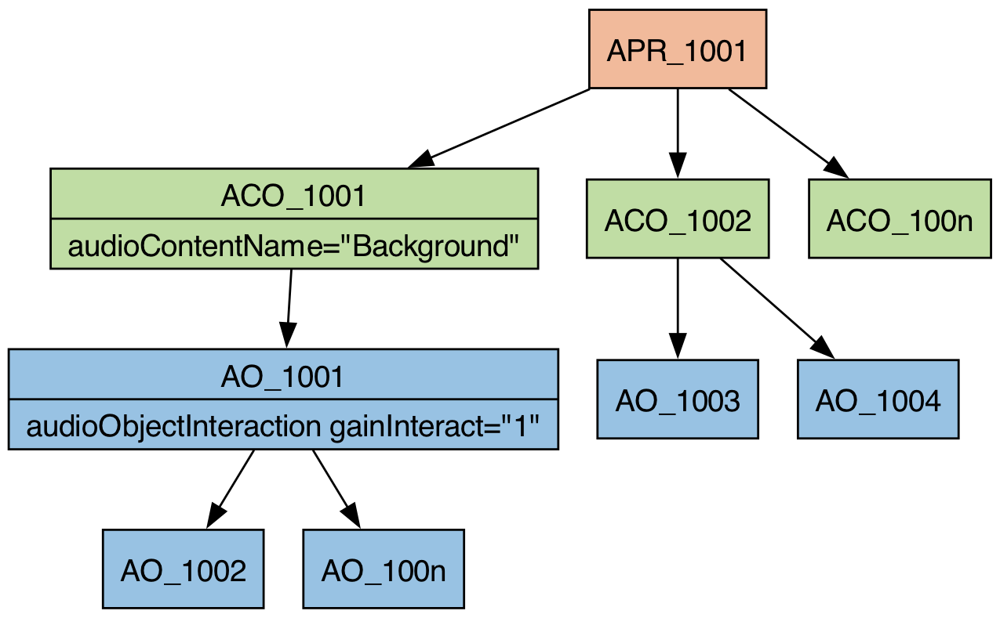

# Description
This use case allows the listener to adjust foreground/background balance, for example to improve speech intelligibility or adjust the mix between a commentator and the ambience in a sports programme.

# Approach
The gain interaction applies to the background objects. All background `audioObjects` are grouped by one `audioObject`, which are referenced by only one `audioContent`. This grouping `audioObject` has the gain interactivity, and be the only `audioObject` with gain interactivity and is just used for grouping and nothing else. Multiple `audioContents` for foreground objects are used.



# Rationale
If the renderer performs loudness preservation (which is expected), the user experience is quite different whether the user can interact with the background or the foreground of the scene. Interacting with the background matches the user's expectation for this type of programme.

# Remarks
This use-case might not take all foreground/background use cases into account. The focus of it lies on speech/presenter/broadcast application and speech intelligibility. For example, in a music-based programme the music could be the foreground and the announcer in the background.

# Example XML

```xml
<?xml version="1.0" encoding="utf-8"?>
<ebuCoreMain xmlns:dc="http://purl.org/dc/elements/1.1/" xmlns="urn:ebu:metadata-schema:ebuCore_2014" xmlns:xsi="http://www.w3.org/2001/XMLSchema-instance" schema="EBU_CORE_20140201.xsd" xml:lang="en">
  <coreMetadata>
    <format>
      <audioFormatExtended version="ITU-R_BS.2076-1">
        <audioProgramme audioProgrammeID="APR_1001" audioProgrammeName="Foreground Background Example">
          <audioContentIDRef>ACO_1001</audioContentIDRef>
          <audioContentIDRef>ACO_1002</audioContentIDRef>
          <audioContentIDRef>ACO_1003</audioContentIDRef>
        </audioProgramme>
    
        <audioContent audioContentID="ACO_1001" audioContentName="Background">
          <audioObjectIDRef>AO_1001</audioObjectIDRef>
        </audioContent>
        <audioContent audioContentID="ACO_1002" audioContentName="Foreground 1">
          <audioObjectIDRef>AO_1004</audioObjectIDRef>
        </audioContent>
        <audioContent audioContentID="ACO_1003" audioContentName="Foreground 2">
          <audioObjectIDRef>AO_1005</audioObjectIDRef>
        </audioContent>
    
        <audioObject audioObjectID="AO_1001" audioObjectName="BackgroundGroup" interact="1">
          <audioObjectInteraction onOffInteract="0" gainInteract="1">
            <gainInteractionRange bound="min">0.500000</gainInteractionRange>
            <gainInteractionRange bound="max">1.000000</gainInteractionRange>
          </audioObjectInteraction>
          <audioObjectIDRef>AO_1002</audioObjectIDRef>
          <audioObjectIDRef>AO_1003</audioObjectIDRef>
        </audioObject>
        <audioObject audioObjectID="AO_1002" audioObjectName="Background Object 1">
          <audioPackFormatIDRef>AP_00031001</audioPackFormatIDRef>
          <audioTrackUIDRef>ATU_00000001</audioTrackUIDRef>
        </audioObject>
        <audioObject audioObjectID="AO_1003" audioObjectName="Background Object 2">
          <audioPackFormatIDRef>AP_00031002</audioPackFormatIDRef>
          <audioTrackUIDRef>ATU_00000002</audioTrackUIDRef>
        </audioObject>
        <audioObject audioObjectID="AO_1004" audioObjectName="Foreground Object 1">
          <audioPackFormatIDRef>AP_00031003</audioPackFormatIDRef>
          <audioTrackUIDRef>ATU_00000003</audioTrackUIDRef>
        </audioObject>
        <audioObject audioObjectID="AO_1005" audioObjectName="Foreground Object 2">
          <audioPackFormatIDRef>AP_00031004</audioPackFormatIDRef>
          <audioTrackUIDRef>ATU_00000004</audioTrackUIDRef>
        </audioObject>
    
        <audioPackFormat audioPackFormatID="AP_00031001" audioPackFormatName="Background Object 1" typeLabel="0003" typeDefinition="Objects">
          <audioChannelFormatIDRef>AC_00031001</audioChannelFormatIDRef>
        </audioPackFormat>
        <audioPackFormat audioPackFormatID="AP_00031002" audioPackFormatName="Background Object 2" typeLabel="0003" typeDefinition="Objects">
          <audioChannelFormatIDRef>AC_00031002</audioChannelFormatIDRef>
        </audioPackFormat>
        <audioPackFormat audioPackFormatID="AP_00031003" audioPackFormatName="Foreground Object 1" typeLabel="0003" typeDefinition="Objects">
          <audioChannelFormatIDRef>AC_00031003</audioChannelFormatIDRef>
        </audioPackFormat>
        <audioPackFormat audioPackFormatID="AP_00031004" audioPackFormatName="Foreground Object 2" typeLabel="0003" typeDefinition="Objects">
          <audioChannelFormatIDRef>AC_00031004</audioChannelFormatIDRef>
        </audioPackFormat>
    
        <audioChannelFormat audioChannelFormatID="AC_00031001" audioChannelFormatName="Background Object 1" typeLabel="0003" typeDefinition="Objects">
          <audioBlockFormat audioBlockFormatID="AB_00031001_00000001">
            <position coordinate="azimuth">0.000000</position>
            <position coordinate="elevation">0.000000</position>
          </audioBlockFormat>
        </audioChannelFormat>
        <audioChannelFormat audioChannelFormatID="AC_00031002" audioChannelFormatName="Background Object 2" typeLabel="0003" typeDefinition="Objects">
          <audioBlockFormat audioBlockFormatID="AB_00031002_00000001">
            <position coordinate="azimuth">0.000000</position>
            <position coordinate="elevation">0.000000</position>
          </audioBlockFormat>
        </audioChannelFormat>
        <audioChannelFormat audioChannelFormatID="AC_00031003" audioChannelFormatName="Foreground Object 1" typeLabel="0003" typeDefinition="Objects">
          <audioBlockFormat audioBlockFormatID="AB_00031003_00000001">
            <position coordinate="azimuth">0.000000</position>
            <position coordinate="elevation">0.000000</position>
          </audioBlockFormat>
        </audioChannelFormat>
        <audioChannelFormat audioChannelFormatID="AC_00031004" audioChannelFormatName="Foreground Object 2" typeLabel="0003" typeDefinition="Objects">
          <audioBlockFormat audioBlockFormatID="AB_00031004_00000001">
            <position coordinate="azimuth">0.000000</position>
            <position coordinate="elevation">0.000000</position>
          </audioBlockFormat>
        </audioChannelFormat>
    
        <audioStreamFormat audioStreamFormatID="AS_00031001" audioStreamFormatName="Background Object 1" formatLabel="0001" formatDefinition="PCM">
          <audioChannelFormatIDRef>AC_00031001</audioChannelFormatIDRef>
          <audioTrackFormatIDRef>AT_00031001_01</audioTrackFormatIDRef>
        </audioStreamFormat>
        <audioStreamFormat audioStreamFormatID="AS_00031002" audioStreamFormatName="Background Object 2" formatLabel="0001" formatDefinition="PCM">
          <audioChannelFormatIDRef>AC_00031002</audioChannelFormatIDRef>
          <audioTrackFormatIDRef>AT_00031002_01</audioTrackFormatIDRef>
        </audioStreamFormat>
        <audioStreamFormat audioStreamFormatID="AS_00031003" audioStreamFormatName="Foreground Object 1" formatLabel="0001" formatDefinition="PCM">
          <audioChannelFormatIDRef>AC_00031003</audioChannelFormatIDRef>
          <audioTrackFormatIDRef>AT_00031003_01</audioTrackFormatIDRef>
        </audioStreamFormat>
        <audioStreamFormat audioStreamFormatID="AS_00031004" audioStreamFormatName="Foreground Object 2" formatLabel="0001" formatDefinition="PCM">
          <audioChannelFormatIDRef>AC_00031004</audioChannelFormatIDRef>
          <audioTrackFormatIDRef>AT_00031004_01</audioTrackFormatIDRef>
        </audioStreamFormat>
    
        <audioTrackFormat audioTrackFormatID="AT_00031001_01" audioTrackFormatName="Background Object 1" formatLabel="0001" formatDefinition="PCM">
          <audioStreamFormatIDRef>AS_00031001</audioStreamFormatIDRef>
        </audioTrackFormat>
        <audioTrackFormat audioTrackFormatID="AT_00031002_01" audioTrackFormatName="Background Object 2" formatLabel="0001" formatDefinition="PCM">
          <audioStreamFormatIDRef>AS_00031002</audioStreamFormatIDRef>
        </audioTrackFormat>
        <audioTrackFormat audioTrackFormatID="AT_00031003_01" audioTrackFormatName="Foreground Object 1" formatLabel="0001" formatDefinition="PCM">
          <audioStreamFormatIDRef>AS_00031003</audioStreamFormatIDRef>
        </audioTrackFormat>
        <audioTrackFormat audioTrackFormatID="AT_00031004_01" audioTrackFormatName="Foreground Object 2" formatLabel="0001" formatDefinition="PCM">
          <audioStreamFormatIDRef>AS_00031004</audioStreamFormatIDRef>
        </audioTrackFormat>
    
        <audioTrackUID UID="ATU_00000001">
          <audioTrackFormatIDRef>AT_00031001_01</audioTrackFormatIDRef>
          <audioPackFormatIDRef>AP_00031001</audioPackFormatIDRef>
        </audioTrackUID>
        <audioTrackUID UID="ATU_00000002">
          <audioTrackFormatIDRef>AT_00031002_01</audioTrackFormatIDRef>
          <audioPackFormatIDRef>AP_00031002</audioPackFormatIDRef>
        </audioTrackUID>
        <audioTrackUID UID="ATU_00000003">
          <audioTrackFormatIDRef>AT_00031003_01</audioTrackFormatIDRef>
          <audioPackFormatIDRef>AP_00031003</audioPackFormatIDRef>
        </audioTrackUID>
        <audioTrackUID UID="ATU_00000004">
          <audioTrackFormatIDRef>AT_00031004_01</audioTrackFormatIDRef>
          <audioPackFormatIDRef>AP_00031004</audioPackFormatIDRef>
        </audioTrackUID>
      </audioFormatExtended>
    </format>
  </coreMetadata>
</ebuCoreMain>
```
