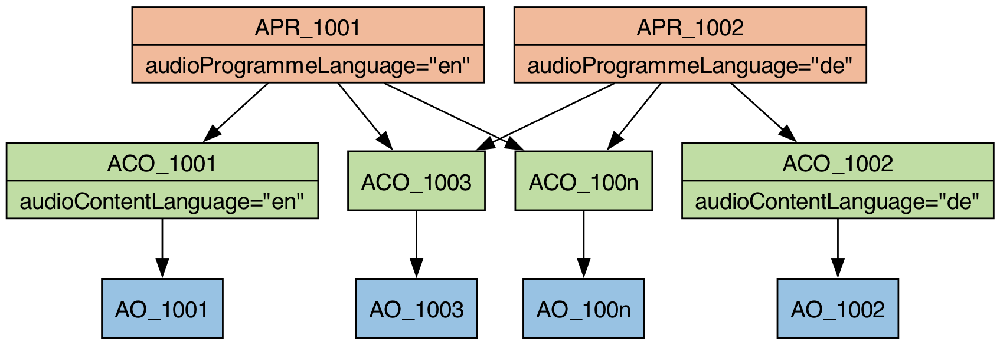
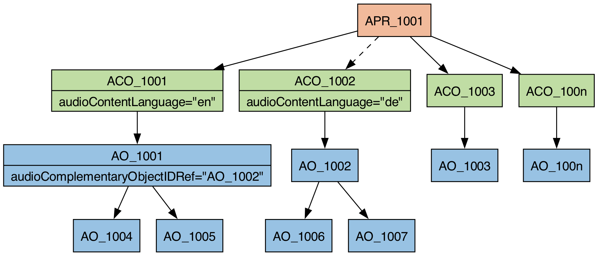

# Description
This use-case allows the listener or an automatic processing system to choose between multiple languages.

# Approaches
Multiple languages within an ADM file can be used in two different scenarios – to express two different intents. On the one hand, there is the non-interactive case, where the language is supposed to be selected before the playout. On the other hand, there is the interactive case, where the languages are supposed to be switched by the listener during the playback. 

## Non-interactive
To indicate that there should not be any user interaction multiple `audioProgrammes` should be used. In each `audioProgramme` the `audioProgrammeLanguage` attribute should be set accordingly. Each `audioProgramme` should reference all the `audioContent` elements which belong to it – the language specific and the language independent ones. Language specific `audioContent` elements should set the `audioContentLanguage` attribute. There should be only one language specific `audioContent` element for each language. There are no restrictions on the number of language independent `audioContent` elements.



## Interactive
To indicate user interaction complementary `audioObjects` should be used. For each language there should be only one complementary `audioObject`, which should only be used to group all language specific `audioObjects`. Also, it should be referenced by its own `audioContent` element to signal language, loudness, etc. The `audioProgramme` should not have an `audioProgrammeLanguage` attribute. There is no restriction on the number of language independent `audioContent` elements.



# Example XML

## Non-interactive

```xml
<?xml version="1.0" encoding="utf-8"?>
<ebuCoreMain xmlns:dc="http://purl.org/dc/elements/1.1/" xmlns="urn:ebu:metadata-schema:ebuCore_2014" xmlns:xsi="http://www.w3.org/2001/XMLSchema-instance" schema="EBU_CORE_20140201.xsd" xml:lang="en">
  <coreMetadata>
    <format>
      <audioFormatExtended version="ITU-R_BS.2076-1">
        <audioProgramme audioProgrammeID="APR_1001" audioProgrammeName="English Programme" audioProgrammeLanguage="en">
          <audioContentIDRef>ACO_1001</audioContentIDRef>
          <audioContentIDRef>ACO_1002</audioContentIDRef>
          <audioContentIDRef>ACO_1003</audioContentIDRef>
        </audioProgramme>
        <audioProgramme audioProgrammeID="APR_1002" audioProgrammeName="German Programme" audioProgrammeLanguage="de">
          <audioContentIDRef>ACO_1004</audioContentIDRef>
          <audioContentIDRef>ACO_1002</audioContentIDRef>
          <audioContentIDRef>ACO_1003</audioContentIDRef>
        </audioProgramme>
    
        <audioContent audioContentID="ACO_1001" audioContentName="English Content" audioContentLanguage="en">
          <audioObjectIDRef>AO_1001</audioObjectIDRef>
        </audioContent>
        <audioContent audioContentID="ACO_1002" audioContentName="Ambience">
          <audioObjectIDRef>AO_1002</audioObjectIDRef>
        </audioContent>
        <audioContent audioContentID="ACO_1003" audioContentName="Music">
          <audioObjectIDRef>AO_1003</audioObjectIDRef>
        </audioContent>
        <audioContent audioContentID="ACO_1004" audioContentName="German Content" audioContentLanguage="de">
          <audioObjectIDRef>AO_1004</audioObjectIDRef>
        </audioContent>
    
        <audioObject audioObjectID="AO_1001" audioObjectName="English Narrator">
          <audioPackFormatIDRef>AP_00031001</audioPackFormatIDRef>
          <audioTrackUIDRef>ATU_00000001</audioTrackUIDRef>
        </audioObject>
        <audioObject audioObjectID="AO_1002" audioObjectName="Ambience">
          <audioPackFormatIDRef>AP_00031002</audioPackFormatIDRef>
          <audioTrackUIDRef>ATU_00000002</audioTrackUIDRef>
        </audioObject>
        <audioObject audioObjectID="AO_1003" audioObjectName="Music">
          <audioPackFormatIDRef>AP_00031003</audioPackFormatIDRef>
          <audioTrackUIDRef>ATU_00000003</audioTrackUIDRef>
        </audioObject>
        <audioObject audioObjectID="AO_1004" audioObjectName="German Narrator">
          <audioPackFormatIDRef>AP_00031004</audioPackFormatIDRef>
          <audioTrackUIDRef>ATU_00000004</audioTrackUIDRef>
        </audioObject>
    
        <audioPackFormat audioPackFormatID="AP_00031001" audioPackFormatName="English Narrator" typeLabel="0003" typeDefinition="Objects">
          <audioChannelFormatIDRef>AC_00031001</audioChannelFormatIDRef>
        </audioPackFormat>
        <audioPackFormat audioPackFormatID="AP_00031002" audioPackFormatName="Ambience" typeLabel="0003" typeDefinition="Objects">
          <audioChannelFormatIDRef>AC_00031002</audioChannelFormatIDRef>
        </audioPackFormat>
        <audioPackFormat audioPackFormatID="AP_00031003" audioPackFormatName="Music" typeLabel="0003" typeDefinition="Objects">
          <audioChannelFormatIDRef>AC_00031003</audioChannelFormatIDRef>
        </audioPackFormat>
        <audioPackFormat audioPackFormatID="AP_00031004" audioPackFormatName="German Narrator" typeLabel="0003" typeDefinition="Objects">
         <audioChannelFormatIDRef>AC_00031004</audioChannelFormatIDRef>
        </audioPackFormat>
    
        <audioChannelFormat audioChannelFormatID="AC_00031001" audioChannelFormatName="English Narrator" typeLabel="0003" typeDefinition="Objects">
          <audioBlockFormat audioBlockFormatID="AB_00031001_00000001">
            <position coordinate="azimuth">0.000000</position>
            <position coordinate="elevation">0.000000</position>
          </audioBlockFormat>
        </audioChannelFormat>
        <audioChannelFormat audioChannelFormatID="AC_00031002" audioChannelFormatName="Ambience" typeLabel="0003" typeDefinition="Objects">
          <audioBlockFormat audioBlockFormatID="AB_00031002_00000001">
            <position coordinate="azimuth">0.000000</position>
            <position coordinate="elevation">0.000000</position>
          </audioBlockFormat>
        </audioChannelFormat>
        <audioChannelFormat audioChannelFormatID="AC_00031003" audioChannelFormatName="Music" typeLabel="0003" typeDefinition="Objects">
          <audioBlockFormat audioBlockFormatID="AB_00031003_00000001">
            <position coordinate="azimuth">0.000000</position>
            <position coordinate="elevation">0.000000</position>
          </audioBlockFormat>
        </audioChannelFormat>
        <audioChannelFormat audioChannelFormatID="AC_00031004" audioChannelFormatName="German Narrator" typeLabel="0003" typeDefinition="Objects">
          <audioBlockFormat audioBlockFormatID="AB_00031004_00000001">
            <position coordinate="azimuth">0.000000</position>
            <position coordinate="elevation">0.000000</position>
          </audioBlockFormat>
        </audioChannelFormat>
    
        <audioStreamFormat audioStreamFormatID="AS_00031001" audioStreamFormatName="English Narrator" formatLabel="0001" formatDefinition="PCM">
          <audioChannelFormatIDRef>AC_00031001</audioChannelFormatIDRef>
          <audioTrackFormatIDRef>AT_00031001_01</audioTrackFormatIDRef>
        </audioStreamFormat>
        <audioStreamFormat audioStreamFormatID="AS_00031002" audioStreamFormatName="Ambience" formatLabel="0001" formatDefinition="PCM">
          <audioChannelFormatIDRef>AC_00031002</audioChannelFormatIDRef>
          <audioTrackFormatIDRef>AT_00031002_01</audioTrackFormatIDRef>
        </audioStreamFormat>
        <audioStreamFormat audioStreamFormatID="AS_00031003" audioStreamFormatName="Music" formatLabel="0001" formatDefinition="PCM">
          <audioChannelFormatIDRef>AC_00031003</audioChannelFormatIDRef>
          <audioTrackFormatIDRef>AT_00031003_01</audioTrackFormatIDRef>
        </audioStreamFormat>
        <audioStreamFormat audioStreamFormatID="AS_00031004" audioStreamFormatName="German Narrator" formatLabel="0001" formatDefinition="PCM">
          <audioChannelFormatIDRef>AC_00031004</audioChannelFormatIDRef>
          <audioTrackFormatIDRef>AT_00031004_01</audioTrackFormatIDRef>
        </audioStreamFormat>
    
        <audioTrackFormat audioTrackFormatID="AT_00031001_01" audioTrackFormatName="English Narrator" formatLabel="0001" formatDefinition="PCM">
          <audioStreamFormatIDRef>AS_00031001</audioStreamFormatIDRef>
        </audioTrackFormat>
        <audioTrackFormat audioTrackFormatID="AT_00031002_01" audioTrackFormatName="Ambience" formatLabel="0001" formatDefinition="PCM">
          <audioStreamFormatIDRef>AS_00031002</audioStreamFormatIDRef>
        </audioTrackFormat>
        <audioTrackFormat audioTrackFormatID="AT_00031003_01" audioTrackFormatName="Music" formatLabel="0001" formatDefinition="PCM">
          <audioStreamFormatIDRef>AS_00031003</audioStreamFormatIDRef>
        </audioTrackFormat>
        <audioTrackFormat audioTrackFormatID="AT_00031004_01" audioTrackFormatName="German Narrator" formatLabel="0001" formatDefinition="PCM">
          <audioStreamFormatIDRef>AS_00031004</audioStreamFormatIDRef>
        </audioTrackFormat>
    
        <audioTrackUID UID="ATU_00000001">
          <audioTrackFormatIDRef>AT_00031001_01</audioTrackFormatIDRef>
          <audioPackFormatIDRef>AP_00031001</audioPackFormatIDRef>
        </audioTrackUID>
        <audioTrackUID UID="ATU_00000002">
          <audioTrackFormatIDRef>AT_00031002_01</audioTrackFormatIDRef>
          <audioPackFormatIDRef>AP_00031002</audioPackFormatIDRef>
        </audioTrackUID>
        <audioTrackUID UID="ATU_00000003">
          <audioTrackFormatIDRef>AT_00031003_01</audioTrackFormatIDRef>
          <audioPackFormatIDRef>AP_00031003</audioPackFormatIDRef>
        </audioTrackUID>
        <audioTrackUID UID="ATU_00000004">
          <audioTrackFormatIDRef>AT_00031004_01</audioTrackFormatIDRef>
          <audioPackFormatIDRef>AP_00031004</audioPackFormatIDRef>
        </audioTrackUID>
      </audioFormatExtended>
    </format>
  </coreMetadata>
</ebuCoreMain>
```

## Interactive

```xml
<?xml version="1.0" encoding="utf-8"?>
<ebuCoreMain xmlns:dc="http://purl.org/dc/elements/1.1/" xmlns="urn:ebu:metadata-schema:ebuCore_2014" xmlns:xsi="http://www.w3.org/2001/XMLSchema-instance" schema="EBU_CORE_20140201.xsd" xml:lang="en">
  <coreMetadata>
    <format>
      <audioFormatExtended version="ITU-R_BS.2076-1">
        <audioProgramme audioProgrammeID="APR_1001" audioProgrammeName="Programme">
          <audioContentIDRef>ACO_1001</audioContentIDRef>
          <audioContentIDRef>ACO_1002</audioContentIDRef>
          <audioContentIDRef>ACO_1003</audioContentIDRef>
          <audioContentIDRef>ACO_1004</audioContentIDRef>
        </audioProgramme>
    
        <audioContent audioContentID="ACO_1001" audioContentName="Englisch Content" audioContentLanguage="en">
          <audioObjectIDRef>AO_1001</audioObjectIDRef>
        </audioContent>
        <audioContent audioContentID="ACO_1002" audioContentName="German Content" audioContentLanguage="de">
          <audioObjectIDRef>AO_1002</audioObjectIDRef>
        </audioContent>
        <audioContent audioContentID="ACO_1003" audioContentName="Ambience">
          <audioObjectIDRef>AO_1003</audioObjectIDRef>
        </audioContent>
        <audioContent audioContentID="ACO_1004" audioContentName="Music">
          <audioObjectIDRef>AO_1004</audioObjectIDRef>
        </audioContent>
    
        <audioObject audioObjectID="AO_1001" audioObjectName="English Narrator">
          <audioPackFormatIDRef>AP_00031001</audioPackFormatIDRef>
          <audioComplementaryObjectIDRef>AO_1002</audioComplementaryObjectIDRef>
          <audioTrackUIDRef>ATU_00000001</audioTrackUIDRef>
        </audioObject>
        <audioObject audioObjectID="AO_1002" audioObjectName="German Narrator">
          <audioPackFormatIDRef>AP_00031002</audioPackFormatIDRef>
          <audioTrackUIDRef>ATU_00000002</audioTrackUIDRef>
        </audioObject>
        <audioObject audioObjectID="AO_1003" audioObjectName="Ambience">
          <audioPackFormatIDRef>AP_00031003</audioPackFormatIDRef>
          <audioTrackUIDRef>ATU_00000003</audioTrackUIDRef>
        </audioObject>
        <audioObject audioObjectID="AO_1004" audioObjectName="Music">
          <audioPackFormatIDRef>AP_00031004</audioPackFormatIDRef>
          <audioTrackUIDRef>ATU_00000004</audioTrackUIDRef>
        </audioObject>
    
        <audioPackFormat audioPackFormatID="AP_00031001" audioPackFormatName="English Narrator" typeLabel="0003" typeDefinition="Objects">
          <audioChannelFormatIDRef>AC_00031001</audioChannelFormatIDRef>
        </audioPackFormat>
        <audioPackFormat audioPackFormatID="AP_00031002" audioPackFormatName="German Narrator" typeLabel="0003" typeDefinition="Objects">
          <audioChannelFormatIDRef>AC_00031002</audioChannelFormatIDRef>
        </audioPackFormat>
        <audioPackFormat audioPackFormatID="AP_00031003" audioPackFormatName="Ambience" typeLabel="0003" typeDefinition="Objects">
          <audioChannelFormatIDRef>AC_00031003</audioChannelFormatIDRef>
        </audioPackFormat>
        <audioPackFormat audioPackFormatID="AP_00031004" audioPackFormatName="Music" typeLabel="0003" typeDefinition="Objects">
          <audioChannelFormatIDRef>AC_00031004</audioChannelFormatIDRef>
        </audioPackFormat>
    
        <audioChannelFormat audioChannelFormatID="AC_00031001" audioChannelFormatName="English Narrator" typeLabel="0003" typeDefinition="Objects">
          <audioBlockFormat audioBlockFormatID="AB_00031001_00000001">
            <position coordinate="azimuth">0.000000</position>
            <position coordinate="elevation">0.000000</position>
          </audioBlockFormat>
        </audioChannelFormat>
        <audioChannelFormat audioChannelFormatID="AC_00031002" audioChannelFormatName="German Narrator" typeLabel="0003" typeDefinition="Objects">
          <audioBlockFormat audioBlockFormatID="AB_00031002_00000001">
            <position coordinate="azimuth">0.000000</position>
            <position coordinate="elevation">0.000000</position>
          </audioBlockFormat>
        </audioChannelFormat>
        <audioChannelFormat audioChannelFormatID="AC_00031003" audioChannelFormatName="Ambience" typeLabel="0003" typeDefinition="Objects">
          <audioBlockFormat audioBlockFormatID="AB_00031003_00000001">
            <position coordinate="azimuth">0.000000</position>
            <position coordinate="elevation">0.000000</position>
          </audioBlockFormat>
        </audioChannelFormat>
        <audioChannelFormat audioChannelFormatID="AC_00031004" audioChannelFormatName="Music" typeLabel="0003" typeDefinition="Objects">
          <audioBlockFormat audioBlockFormatID="AB_00031004_00000001">
            <position coordinate="azimuth">0.000000</position>
            <position coordinate="elevation">0.000000</position>
          </audioBlockFormat>
        </audioChannelFormat>
    
        <audioStreamFormat audioStreamFormatID="AS_00031001" audioStreamFormatName="English Narrator" formatLabel="0001" formatDefinition="PCM">
          <audioChannelFormatIDRef>AC_00031001</audioChannelFormatIDRef>
          <audioTrackFormatIDRef>AT_00031001_01</audioTrackFormatIDRef>
        </audioStreamFormat>
        <audioStreamFormat audioStreamFormatID="AS_00031002" audioStreamFormatName="German Narrator" formatLabel="0001" formatDefinition="PCM">
          <audioChannelFormatIDRef>AC_00031002</audioChannelFormatIDRef>
          <audioTrackFormatIDRef>AT_00031002_01</audioTrackFormatIDRef>
        </audioStreamFormat>
        <audioStreamFormat audioStreamFormatID="AS_00031003" audioStreamFormatName="Ambience" formatLabel="0001" formatDefinition="PCM">
          <audioChannelFormatIDRef>AC_00031003</audioChannelFormatIDRef>
          <audioTrackFormatIDRef>AT_00031003_01</audioTrackFormatIDRef>
        </audioStreamFormat>
        <audioStreamFormat audioStreamFormatID="AS_00031004" audioStreamFormatName="Music" formatLabel="0001" formatDefinition="PCM">
          <audioChannelFormatIDRef>AC_00031004</audioChannelFormatIDRef>
          <audioTrackFormatIDRef>AT_00031004_01</audioTrackFormatIDRef>
        </audioStreamFormat>
    
        <audioTrackFormat audioTrackFormatID="AT_00031001_01" audioTrackFormatName="English Narrator" formatLabel="0001" formatDefinition="PCM">
          <audioStreamFormatIDRef>AS_00031001</audioStreamFormatIDRef>
        </audioTrackFormat>
        <audioTrackFormat audioTrackFormatID="AT_00031002_01" audioTrackFormatName="German Narrator" formatLabel="0001" formatDefinition="PCM">
          <audioStreamFormatIDRef>AS_00031002</audioStreamFormatIDRef>
        </audioTrackFormat>
        <audioTrackFormat audioTrackFormatID="AT_00031003_01" audioTrackFormatName="Ambience" formatLabel="0001" formatDefinition="PCM">
          <audioStreamFormatIDRef>AS_00031003</audioStreamFormatIDRef>
        </audioTrackFormat>
        <audioTrackFormat audioTrackFormatID="AT_00031004_01" audioTrackFormatName="Music" formatLabel="0001" formatDefinition="PCM">
          <audioStreamFormatIDRef>AS_00031004</audioStreamFormatIDRef>
        </audioTrackFormat>
    
        <audioTrackUID UID="ATU_00000001">
          <audioTrackFormatIDRef>AT_00031001_01</audioTrackFormatIDRef>
          <audioPackFormatIDRef>AP_00031001</audioPackFormatIDRef>
        </audioTrackUID>
        <audioTrackUID UID="ATU_00000002">
          <audioTrackFormatIDRef>AT_00031002_01</audioTrackFormatIDRef>
          <audioPackFormatIDRef>AP_00031002</audioPackFormatIDRef>
        </audioTrackUID>
        <audioTrackUID UID="ATU_00000003">
          <audioTrackFormatIDRef>AT_00031003_01</audioTrackFormatIDRef>
          <audioPackFormatIDRef>AP_00031003</audioPackFormatIDRef>
        </audioTrackUID>
        <audioTrackUID UID="ATU_00000004">
          <audioTrackFormatIDRef>AT_00031004_01</audioTrackFormatIDRef>
          <audioPackFormatIDRef>AP_00031004</audioPackFormatIDRef>
        </audioTrackUID>
      </audioFormatExtended>
    </format>
  </coreMetadata>
</ebuCoreMain>
```
