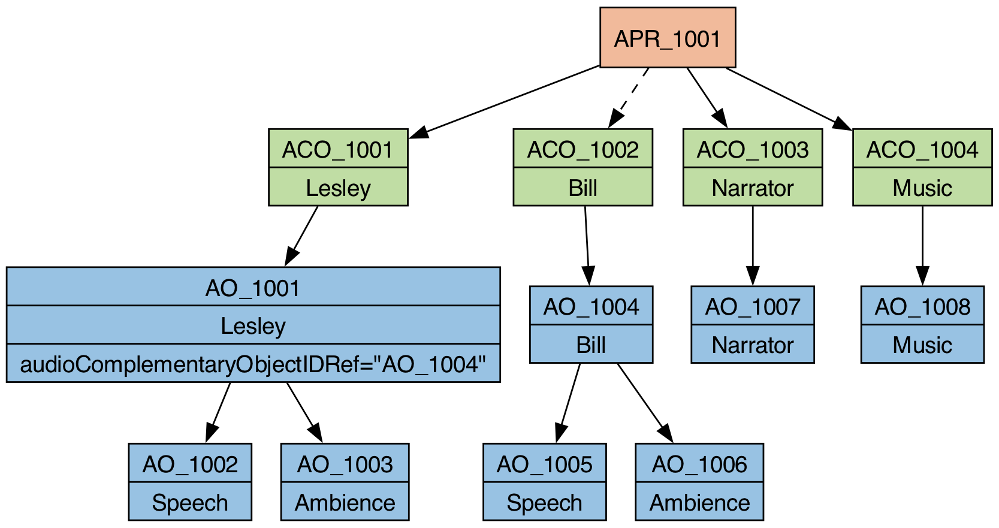

# Description
This use-case allows the listener to switch between different storylines. This is similar to the [interactive multiple language](multiple_languages.md) use-case, but instead of switching between languages, the user switches between storylines.

# Approach
The two storylines, 'Lesley' and 'Bill', are each represented by their own `audioContents`, which in turn each reference `audioObjects` that are complementary with each other. Below each of these two storyline complementary `audioObjects` are separate `audioObjects` for speech and ambient sound. There are also `audioObjects` that are common to both storylines.



# Example XML

```xml
<?xml version="1.0" encoding="utf-8"?>
<ebuCoreMain xmlns:dc="http://purl.org/dc/elements/1.1/" xmlns="urn:ebu:metadata-schema:ebuCore_2014" xmlns:xsi="http://www.w3.org/2001/XMLSchema-instance" schema="EBU_CORE_20140201.xsd" xml:lang="en">
  <coreMetadata>
    <format>
      <audioFormatExtended version="ITU-R_BS.2076-1">
        <audioProgramme audioProgrammeID="APR_1001" audioProgrammeName="Programme" audioProgrammeLanguage="en">
          <audioContentIDRef>ACO_1001</audioContentIDRef>
          <audioContentIDRef>ACO_1002</audioContentIDRef>
          <audioContentIDRef>ACO_1003</audioContentIDRef>
          <audioContentIDRef>ACO_1004</audioContentIDRef>
        </audioProgramme>
    
        <audioContent audioContentID="ACO_1001" audioContentName="Lesley">
          <audioObjectIDRef>AO_1001</audioObjectIDRef>
        </audioContent>
        <audioContent audioContentID="ACO_1002" audioContentName="Bill">
          <audioObjectIDRef>AO_1004</audioObjectIDRef>
        </audioContent>
        <audioContent audioContentID="ACO_1003" audioContentName="Intro Narrator">
          <audioObjectIDRef>AO_1007</audioObjectIDRef>
        </audioContent>
        <audioContent audioContentID="ACO_1004" audioContentName="Intro Music">
          <audioObjectIDRef>AO_1008</audioObjectIDRef>
        </audioContent>
    
        <audioObject audioObjectID="AO_1001" audioObjectName="Lesley">
          <audioObjectIDRef>AO_1002</audioObjectIDRef>
          <audioObjectIDRef>AO_1003</audioObjectIDRef>
          <audioComplementaryObjectIDRef>AO_1004</audioComplementaryObjectIDRef>
        </audioObject>
        <audioObject audioObjectID="AO_1002" audioObjectName="Speech">
          <audioPackFormatIDRef>AP_00031001</audioPackFormatIDRef>
          <audioTrackUIDRef>ATU_00000001</audioTrackUIDRef>
        </audioObject>
        <audioObject audioObjectID="AO_1003" audioObjectName="Ambience">
          <audioPackFormatIDRef>AP_00031002</audioPackFormatIDRef>
          <audioTrackUIDRef>ATU_00000002</audioTrackUIDRef>
        </audioObject>
        <audioObject audioObjectID="AO_1004" audioObjectName="Bill">
          <audioObjectIDRef>AO_1005</audioObjectIDRef>
          <audioObjectIDRef>AO_1006</audioObjectIDRef>
        </audioObject>
        <audioObject audioObjectID="AO_1005" audioObjectName="Speech">
          <audioPackFormatIDRef>AP_00031003</audioPackFormatIDRef>
          <audioTrackUIDRef>ATU_00000003</audioTrackUIDRef>
        </audioObject>
        <audioObject audioObjectID="AO_1006" audioObjectName="Ambience">
          <audioPackFormatIDRef>AP_00031004</audioPackFormatIDRef>
          <audioTrackUIDRef>ATU_00000004</audioTrackUIDRef>
        </audioObject>
        <audioObject audioObjectID="AO_1007" audioObjectName="Intro Narrator">
          <audioPackFormatIDRef>AP_00031005</audioPackFormatIDRef>
          <audioTrackUIDRef>ATU_00000005</audioTrackUIDRef>
        </audioObject>
        <audioObject audioObjectID="AO_1008" audioObjectName="Intro Music">
          <audioPackFormatIDRef>AP_00031006</audioPackFormatIDRef>
          <audioTrackUIDRef>ATU_00000006</audioTrackUIDRef>
        </audioObject>
    
        <audioPackFormat audioPackFormatID="AP_00031001" audioPackFormatName="Speech" typeLabel="0003" typeDefinition="Objects">
          <audioChannelFormatIDRef>AC_00031001</audioChannelFormatIDRef>
        </audioPackFormat>
        <audioPackFormat audioPackFormatID="AP_00031002" audioPackFormatName="Ambience" typeLabel="0003" typeDefinition="Objects">
          <audioChannelFormatIDRef>AC_00031002</audioChannelFormatIDRef>
        </audioPackFormat>
        <audioPackFormat audioPackFormatID="AP_00031003" audioPackFormatName="Speech" typeLabel="0003" typeDefinition="Objects">
          <audioChannelFormatIDRef>AC_00031003</audioChannelFormatIDRef>
        </audioPackFormat>
        <audioPackFormat audioPackFormatID="AP_00031004" audioPackFormatName="Ambience" typeLabel="0003" typeDefinition="Objects">
          <audioChannelFormatIDRef>AC_00031004</audioChannelFormatIDRef>
        </audioPackFormat>
        <audioPackFormat audioPackFormatID="AP_00031005" audioPackFormatName="Intro Narrator" typeLabel="0003" typeDefinition="Objects">
          <audioChannelFormatIDRef>AC_00031005</audioChannelFormatIDRef>
        </audioPackFormat>
        <audioPackFormat audioPackFormatID="AP_00031006" audioPackFormatName="Intro Music" typeLabel="0003" typeDefinition="Objects">
          <audioChannelFormatIDRef>AC_00031006</audioChannelFormatIDRef>
        </audioPackFormat>
    
        <audioChannelFormat audioChannelFormatID="AC_00031001" audioChannelFormatName="Speech" typeLabel="0003" typeDefinition="Objects">
          <audioBlockFormat audioBlockFormatID="AB_00031001_00000001">
            <position coordinate="azimuth">0.000000</position>
            <position coordinate="elevation">0.000000</position>
          </audioBlockFormat>
        </audioChannelFormat>
        <audioChannelFormat audioChannelFormatID="AC_00031002" audioChannelFormatName="Ambience" typeLabel="0003" typeDefinition="Objects">
          <audioBlockFormat audioBlockFormatID="AB_00031002_00000001">
            <position coordinate="azimuth">0.000000</position>
            <position coordinate="elevation">0.000000</position>
          </audioBlockFormat>
        </audioChannelFormat>
        <audioChannelFormat audioChannelFormatID="AC_00031003" audioChannelFormatName="Speech" typeLabel="0003" typeDefinition="Objects">
          <audioBlockFormat audioBlockFormatID="AB_00031003_00000001">
            <position coordinate="azimuth">0.000000</position>
            <position coordinate="elevation">0.000000</position>
          </audioBlockFormat>
        </audioChannelFormat>
        <audioChannelFormat audioChannelFormatID="AC_00031004" audioChannelFormatName="Ambience" typeLabel="0003" typeDefinition="Objects">
          <audioBlockFormat audioBlockFormatID="AB_00031004_00000001">
            <position coordinate="azimuth">0.000000</position>
            <position coordinate="elevation">0.000000</position>
          </audioBlockFormat>
        </audioChannelFormat>
        <audioChannelFormat audioChannelFormatID="AC_00031005" audioChannelFormatName="Intro Narrator" typeLabel="0003" typeDefinition="Objects">
          <audioBlockFormat audioBlockFormatID="AB_00031005_00000001">
            <position coordinate="azimuth">0.000000</position>
            <position coordinate="elevation">0.000000</position>
          </audioBlockFormat>
        </audioChannelFormat>
        <audioChannelFormat audioChannelFormatID="AC_00031006" audioChannelFormatName="Intro Music" typeLabel="0003" typeDefinition="Objects">
          <audioBlockFormat audioBlockFormatID="AB_00031006_00000001">
            <position coordinate="azimuth">0.000000</position>
            <position coordinate="elevation">0.000000</position>
          </audioBlockFormat>
        </audioChannelFormat>
    
        <audioStreamFormat audioStreamFormatID="AS_00031001" audioStreamFormatName="Speech" formatLabel="0001" formatDefinition="PCM">
          <audioChannelFormatIDRef>AC_00031001</audioChannelFormatIDRef>
          <audioTrackFormatIDRef>AT_00031001_01</audioTrackFormatIDRef>
        </audioStreamFormat>
        <audioStreamFormat audioStreamFormatID="AS_00031002" audioStreamFormatName="Ambience" formatLabel="0001" formatDefinition="PCM">
          <audioChannelFormatIDRef>AC_00031002</audioChannelFormatIDRef>
          <audioTrackFormatIDRef>AT_00031002_01</audioTrackFormatIDRef>
        </audioStreamFormat>
        <audioStreamFormat audioStreamFormatID="AS_00031003" audioStreamFormatName="Speech" formatLabel="0001" formatDefinition="PCM">
          <audioChannelFormatIDRef>AC_00031003</audioChannelFormatIDRef>
          <audioTrackFormatIDRef>AT_00031003_01</audioTrackFormatIDRef>
        </audioStreamFormat>
        <audioStreamFormat audioStreamFormatID="AS_00031004" audioStreamFormatName="Ambience" formatLabel="0001" formatDefinition="PCM">
          <audioChannelFormatIDRef>AC_00031004</audioChannelFormatIDRef>
          <audioTrackFormatIDRef>AT_00031004_01</audioTrackFormatIDRef>
        </audioStreamFormat>
        <audioStreamFormat audioStreamFormatID="AS_00031005" audioStreamFormatName="Intro Narrator" formatLabel="0001" formatDefinition="PCM">
          <audioChannelFormatIDRef>AC_00031005</audioChannelFormatIDRef>
          <audioTrackFormatIDRef>AT_00031005_01</audioTrackFormatIDRef>
        </audioStreamFormat>
        <audioStreamFormat audioStreamFormatID="AS_00031006" audioStreamFormatName="Intro Music" formatLabel="0001" formatDefinition="PCM">
          <audioChannelFormatIDRef>AC_00031006</audioChannelFormatIDRef>
          <audioTrackFormatIDRef>AT_00031006_01</audioTrackFormatIDRef>
        </audioStreamFormat>
    
        <audioTrackFormat audioTrackFormatID="AT_00031001_01" audioTrackFormatName="Speech" formatLabel="0001" formatDefinition="PCM">
          <audioStreamFormatIDRef>AS_00031001</audioStreamFormatIDRef>
        </audioTrackFormat>
        <audioTrackFormat audioTrackFormatID="AT_00031002_01" audioTrackFormatName="Ambience" formatLabel="0001" formatDefinition="PCM">
          <audioStreamFormatIDRef>AS_00031002</audioStreamFormatIDRef>
        </audioTrackFormat>
        <audioTrackFormat audioTrackFormatID="AT_00031003_01" audioTrackFormatName="Speech" formatLabel="0001" formatDefinition="PCM">
          <audioStreamFormatIDRef>AS_00031003</audioStreamFormatIDRef>
        </audioTrackFormat>
        <audioTrackFormat audioTrackFormatID="AT_00031004_01" audioTrackFormatName="Ambience" formatLabel="0001" formatDefinition="PCM">
          <audioStreamFormatIDRef>AS_00031004</audioStreamFormatIDRef>
        </audioTrackFormat>
        <audioTrackFormat audioTrackFormatID="AT_00031005_01" audioTrackFormatName="Intro Narrator" formatLabel="0001" formatDefinition="PCM">
          <audioStreamFormatIDRef>AS_00031005</audioStreamFormatIDRef>
        </audioTrackFormat>
        <audioTrackFormat audioTrackFormatID="AT_00031006_01" audioTrackFormatName="Intro Music" formatLabel="0001" formatDefinition="PCM">
          <audioStreamFormatIDRef>AS_00031006</audioStreamFormatIDRef>
        </audioTrackFormat>
    
        <audioTrackUID UID="ATU_00000001">
          <audioTrackFormatIDRef>AT_00031001_01</audioTrackFormatIDRef>
          <audioPackFormatIDRef>AP_00031001</audioPackFormatIDRef>
        </audioTrackUID>
        <audioTrackUID UID="ATU_00000002">
          <audioTrackFormatIDRef>AT_00031002_01</audioTrackFormatIDRef>
          <audioPackFormatIDRef>AP_00031002</audioPackFormatIDRef>
        </audioTrackUID>
        <audioTrackUID UID="ATU_00000003">
          <audioTrackFormatIDRef>AT_00031003_01</audioTrackFormatIDRef>
          <audioPackFormatIDRef>AP_00031003</audioPackFormatIDRef>
        </audioTrackUID>
        <audioTrackUID UID="ATU_00000004">
          <audioTrackFormatIDRef>AT_00031004_01</audioTrackFormatIDRef>
          <audioPackFormatIDRef>AP_00031004</audioPackFormatIDRef>
        </audioTrackUID>
        <audioTrackUID UID="ATU_00000005">
          <audioTrackFormatIDRef>AT_00031005_01</audioTrackFormatIDRef>
          <audioPackFormatIDRef>AP_00031005</audioPackFormatIDRef>
        </audioTrackUID>
        <audioTrackUID UID="ATU_00000006">
          <audioTrackFormatIDRef>AT_00031006_01</audioTrackFormatIDRef>
          <audioPackFormatIDRef>AP_00031006</audioPackFormatIDRef>
        </audioTrackUID>
      </audioFormatExtended>
    </format>
  </coreMetadata>
</ebuCoreMain>
```
