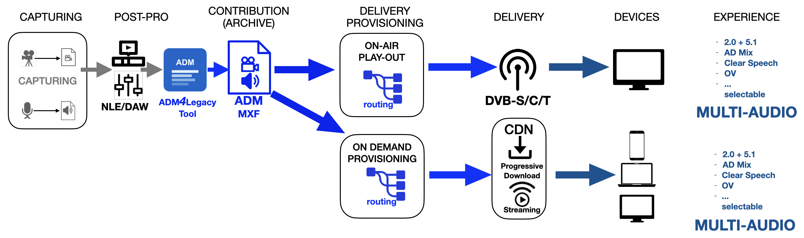
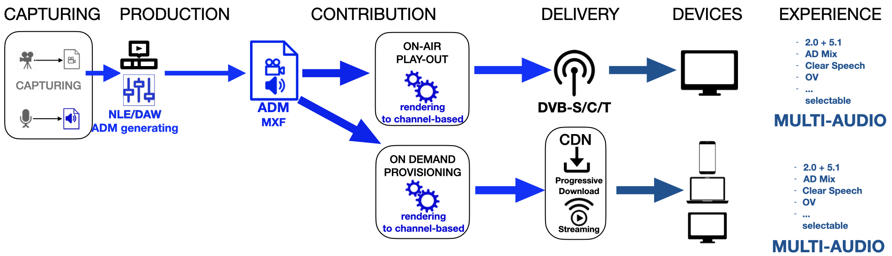
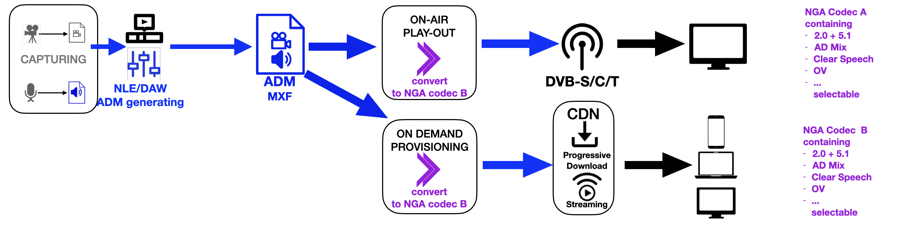

# ADM WORKFLOWS - A High Level View

There are three obvious workflows for ADM that broadcaster can build-upon.

Step-by-step they also form a gradual way of implementation and adding complexity
when migrating from conventional "legacy" audio production to object-based and NGA delivery

## STAGE 1. ADM*4*Legacy

For existing conventinal channel-based production and distribution workflows

  - no object-based/NGA production and rendering required
  - ADM applied only as inherent descriptor for tech specs of file
  - no (more) sidecar file workflows required
  - enabling track-routing and (semi-)automation for all workflows
  - driving on-air and on-demand delivery for *MULTI-AUDIO*

->[ADM2Legacy](ADM4Legacy-OnDemand.md) shows more details of this stage.

## STAGE 2. ADM*2*Legacy

First migration step to benefit from leaner object-based ADM production techniques - without yet NGA delivery options 

- ADM applied for genuine object-based mixes
- delivery to conventional, "legacy" audio codecs requires hosted rendering
- benefits are:
     - sources and stems kept seperately (smaller track counts)
     - multiple rendering format as required (2.0, 5.1. 5.1.4, binaural)
     - enabling on-air and on-demand delivery with *MULTI-AUDIO*

->[ADM2NGA](ADM2Legacy.md) shows more details of this stage.

## STAGE 3. ADM*2*NGA

Ultimate move to end-to-end ADM-NGA production and delivry chain.

  - ADM applied for genuine object-based mixes
  - sources and stems kept seperately (smaller track counts)
  - enabling conversion into mutliple NGA codecs (AC-4, MPEG-H, Eclipsa)
    as required by platform
  - rendering on NGA capable end-user device allows ultimate personalisation for
    - Speech Intelligibility,
    - Audio Description
    - Immersive Reproduction

->The [ADM Studio](ADM_studio.md) is a paradigmatic implementation of this stage.
